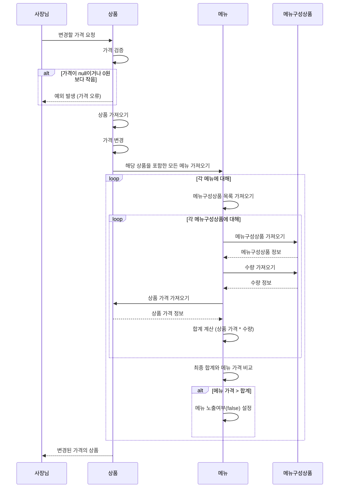
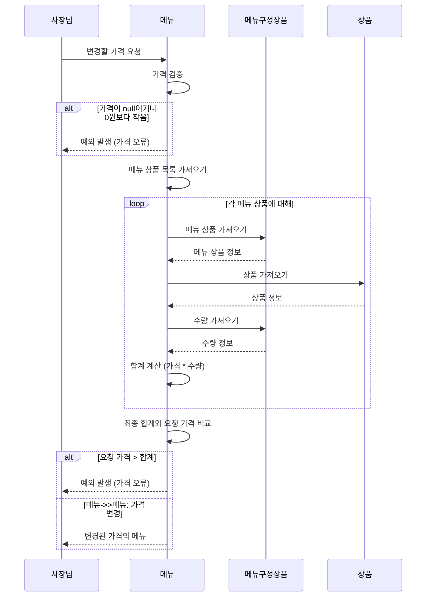
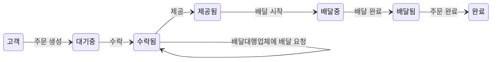
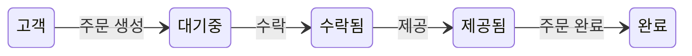
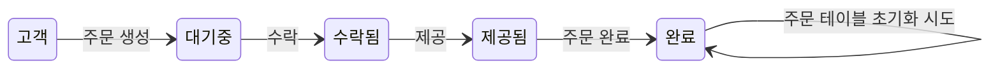
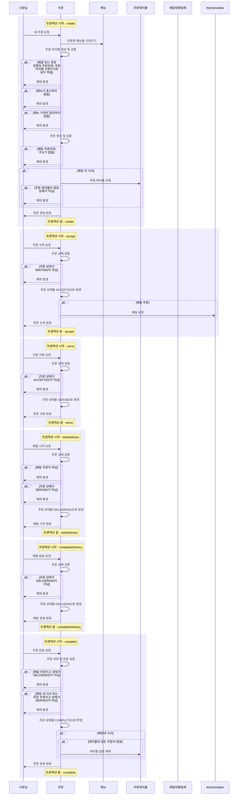
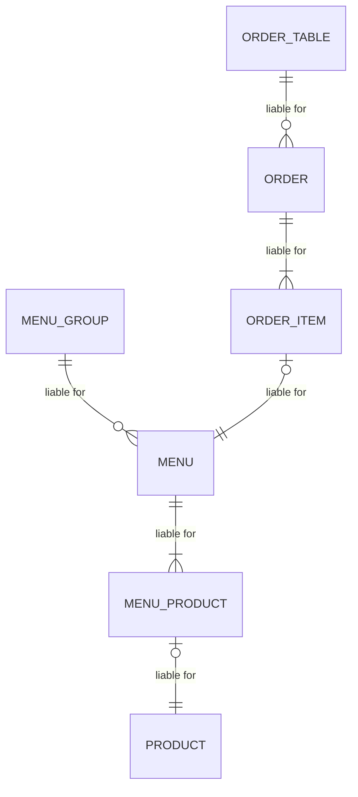

# 키친포스

## 퀵 스타트

```sh  
cd dockerdocker 
compose -p kitchenpos up -d  
```  

## 요구 사항

### 상품

- 상품을 등록할 수 있다.
- 상품의 가격이 올바르지 않으면 등록할 수 없다.
  - 상품의 가격은 0원 이상이어야 한다.
- 상품의 이름이 올바르지 않으면 등록할 수 없다.
  - 상품의 이름에는 비속어가 포함될 수 없다.
- 상품의 가격을 변경할 수 있다.
- 상품의 가격이 올바르지 않으면 변경할 수 없다.
  - 상품의 가격은 0원 이상이어야 한다.
- 상품의 가격이 변경될 때 메뉴의 가격이 메뉴 구성 상품들의 가격의 합보다 크면 메뉴가 숨겨진다.
- 상품의 목록을 조회할 수 있다.

### 메뉴 그룹

- 메뉴 그룹을 등록할 수 있다.
- 메뉴 그룹의 이름이 올바르지 않으면 등록할 수 없다.
  - 메뉴 그룹의 이름은 비워 둘 수 없다.
- 메뉴 그룹의 목록을 조회할 수 있다.

### 메뉴

- 1 개 이상의 등록된 상품으로 메뉴를 등록할 수 있다.
- 상품이 없으면 등록할 수 없다.
- 메뉴 구성 상품의 수량은 0개 이상이어야 한다.
- 메뉴의 가격이 올바르지 않으면 등록할 수 없다.
  - 메뉴의 가격은 0원 이상이어야 한다.
- 메뉴 구성 상품의 가격의 합은 메뉴의 가격보다 크거나 같아야 한다.
- 메뉴는 특정 메뉴 그룹에 속해야 한다.
- 메뉴의 이름이 올바르지 않으면 등록할 수 없다.
  - 메뉴의 이름에는 비속어가 포함될 수 없다.
- 메뉴의 가격을 변경할 수 있다.
- 메뉴의 가격이 올바르지 않으면 변경할 수 없다.
  - 메뉴의 가격은 0원 이상이어야 한다.
- 메뉴 구성 상품 가격의 합은 메뉴의 가격보다 크거나 같아야 한다.
- 메뉴를 노출할 수 있다.
- 메뉴의 가격이 메뉴 구성 상품 가격의 합보다 높을 경우 메뉴를 노출할 수 없다.
- 메뉴를 숨길 수 있다.
- 메뉴의 목록을 조회할 수 있다.

### 주문 테이블

- 주문 테이블을 등록할 수 있다.
- 주문 테이블의 이름이 올바르지 않으면 등록할 수 없다.
  - 주문 테이블의 이름은 비워 둘 수 없다.
- 빈 테이블을 해지할 수 있다.
- 빈 테이블로 설정할 수 있다.
- 완료되지 않은 주문이 있는 주문 테이블은 빈 테이블로 설정할 수 없다.
- 방문한 고객 수를 변경할 수 있다.
- 방문한 고객 수가 올바르지 않으면 변경할 수 없다.
  - 방문한 고객 수는 0명 이상이어야 한다.
- 빈 테이블은 방문한 고객 수를 변경할 수 없다.
- 주문 테이블의 목록을 조회할 수 있다.

### 주문

- 1개 이상의 등록된 메뉴로 배달 주문을 등록할 수 있다.
- 1개 이상의 등록된 메뉴로 포장 주문을 등록할 수 있다.
- 1개 이상의 등록된 메뉴로 매장 주문을 등록할 수 있다.
- 주문 유형이 올바르지 않으면 등록할 수 없다.
- 메뉴가 없으면 등록할 수 없다.
- 매장 주문은 주문 항목의 수량이 0개 미만일 수 있다.
- 매장 주문을 제외한 주문의 경우 주문 항목의 수량은 0개 이상이어야 한다.
- 배달 주소가 올바르지 않으면 배달 주문을 등록할 수 없다.
  - 배달 주소는 비워 둘 수 없다.
- 빈 테이블에는 매장 주문을 등록할 수 없다.
- 숨겨진 메뉴는 주문할 수 없다.
- 주문한 메뉴의 가격은 실제 메뉴 가격과 일치해야 한다.
- 주문을 접수한다.
- 접수 대기 중인 주문만 접수할 수 있다.
- 배달 주문을 접수되면 배달 대행사를 호출한다.
- 주문을 서빙한다.
- 접수된 주문만 서빙할 수 있다.
- 주문을 배달한다.
- 배달 주문만 배달할 수 있다.
- 서빙된 주문만 배달할 수 있다.
- 주문을 배달 완료한다.
- 배달 중인 주문만 배달 완료할 수 있다.
- 주문을 완료한다.
- 배달 주문의 경우 배달 완료된 주문만 완료할 수 있다.
- 포장 및 매장 주문의 경우 서빙된 주문만 완료할 수 있다.
- 주문 테이블의 모든 매장 주문이 완료되면 빈 테이블로 설정한다.
- 완료되지 않은 매장 주문이 있는 주문 테이블은 빈 테이블로 설정하지 않는다.
- 주문 목록을 조회할 수 있다.

## 용어 사전

### 공통

| 한글명 | 영문명       | 설명                                                        |  
|-----|-----------|-----------------------------------------------------------|  
| 비속어 | profanity | 욕설 또는 저속한 표현을 의미하며, 특정인에게 모욕감을 주거나 비하하는 표현이 포함된 단어를 의미한다. |  

### 인물

| 한글명    | 영문명         | 설명                            |  
|--------|-------------|-------------------------------|  
| 가게 사장님 | store owner | 키친포스에서 음식을 판매하는 가게 사장님을 의미한다. |  
| 고객     | customer    | 키친포스앱을 이용하는 고객을 의미한다.         |  
| 배달 기사님 | rider       | 가게 사장님이 만든 음식을 배달하는 분을 의미한다.  |  

### 시스템

| 한글명        | 영문명                        | 설명                                                |  
|------------|----------------------------|---------------------------------------------------|   
| 키친 포스      | kitchen pos                | 상품과 메뉴를 관리하며 고객이 음식을 주문하고 배달을 요청하는 우리의 시스템을 의미한다. |
| 배달대행업체     | delivery agency            | 배달 기사를 매칭해주는 업체를 의미한다.                            |
| 비속어 탐지 시스템 | profanity detection system | 비속어가 포함되어있는지 검사해주는 시스템을 의미한다.                     |  

### 상품

| 한글명      | 영문명                  | 설명             |  
|----------|----------------------|----------------|  
| 상품       | product              | 메뉴를 구성하는 단위이다. |  
| 상품 명     | product name         | 상품의 이름을 의미한다.  |  
| 상품 가격    | product price        | 상품의 가격을 의미한다.  |  
| 상품 생성    | create product       | 상품을 생성한다.      |  
| 상품 가격 변경 | change product price | 상품의 가격을 변경한다.  |  

### 메뉴 그룹

| 한글명      | 영문명               | 설명                                              |
|----------|-------------------|-------------------------------------------------|
| 메뉴 그룹    | menu group        | 메뉴의 상위그룹을 의미한다. 예를 들어 한마리 치킨 메뉴, 두마리 치킨 메뉴가 있다. |  
| 메뉴 그룹 이름 | menu group name   | 메뉴 그룹의 이름을 의미한다.                                |  
| 메뉴 그룹 생성 | create menu group | 메뉴 그룹을 생성하는것을 의미한다.                             |

### 메뉴

| 한글명      | 영문명            | 설명                                                  |  
|----------|----------------|-----------------------------------------------------|  
| 메뉴       | menu           | 주문의 최소 단위를 의미한다. 한 개 이상의 상품으로 구성되어있으며, 메뉴 그룹에 포함된다. |  
| 메뉴 이름    | menu name      | 메뉴의 이름을 의미한다.                                       |  
| 메뉴 구성 상품 | menu product   | 메뉴를 구성하는 상품과 수량 정보를 나타낸다.                           |
| 메뉴 생성    | create menu    | 메뉴 그룹을 생성하는것을 의미한다.                                 |  
| 메뉴 노출 여부 | is displayed   | 메뉴가 고객에게 노출될 수 있는지 여부                               |
| 메뉴 노출    | display menu   | 메뉴를 노출하는것을 의미한다.                                    |  
| 메뉴 숨김    | undisplay menu | 메뉴를 비노출하는것을 의미한다.                                   |  

### 주문 테이블

| 한글명             | 영문명                                   | 설명                                    |  
|-----------------|---------------------------------------|---------------------------------------|  
| 주문 테이블          | order-table                           | 고객이 주문을 하기 위해 착석하는 테이블을 의미한다.         |
| 주문 테이블 명        | order-table name                      | 주문 테이블의 이름을 의미한다.                     |
| 주문 테이블 점유여부     | occupied                              | 주문 테이블의 점유 여부를 의미한다. 점유됨과 점유해제로 구분된다. |
| 고객의 수           | number of guests                      | 주문 테이블을 이용중인 고객의 수를 의미한다.             |
| 주문 테이블 생성       | create table                          | 주문 테이블을 생성하는것을 의미한다.                  |
| 주문 테이블 착석       | sit order-table                       | 주문 테이블을 점유중인 상태로 변경한다.                |
| 주문 테이블 초기화      | clear order-table                     | 주문 테이블을 초기화한다.                        |
| 주문 테이블 고객의 수 변경 | change order-table's number of guests | 생성된 주문 테이블의 고객의 수를 변경한다.              |

#### 주문 유형

| 한글명     | 영문명      | 설명                       |  
|---------|----------|--------------------------|
| 배달 주문   | delivery | 음식이 배달되는 주문 유형을 의미한다.    |  
| 포장 주문   | takeout  | 음식이 포장되는 주문 유형을 의미한다.    |  
| 매장 내 식사 | eat in   | 매장 내에서 식사하는 주문 유형을 의미한다. |

### 주문

| 한글명       | 영문명                      | 설명                         |  
|-----------|--------------------------|----------------------------|  
| 주문        | order                    | 고객이 구매한 메뉴나 서비스를 나타낸다.     |  
| 주문 유형     | order type               | 고객이 주문한 메뉴를 제공받는 유형을 의미한다. |     
| 주문 상태     | order status             | 주문의 진행상황을 의미한다.            |
| 주문 생성 시간  | order date time          | 주문 데이터가 생성된 시간을 의미한다.      |  
| 배달 주소     | delivery address         | 음식이 배달되어야하는 주소를 의미한다.      |  
| 주문 생성     | create order             | 주문을 생성하는것을 의미한다.           |  
| 주문 아이템    | order line item          | 주문 받은 아이템을 의미한다.           |  
| 주문 아이템 수량 | order line item quantity | 주문 받은 아이템의 수량을 의미한다.       |  
| 주문 아이템 가격 | order line item price    | 주문 받은 아이템의 가격을 의미한다.       |  

#### 주문 상태

| 한글명  | 영문명        | 설명                                      |  
|------|------------|-----------------------------------------|
| 대기중  | waiting    | 고객이 주문을 요청했지만, 아직 가게 사장님이 수락하지 않은 상태이다. |
| 수락됨  | accepted   | 가게 사장님이 고객의 주문을 수락한 상태이다.               |
| 제공됨  | served     | 제조가 완료된 음식이 고객 또는 배달기사에게 제공된 상태이다.      |  
| 배달 중 | delivering | 배달주문일 때, 배달이 진행중인 상태이다.                 |  
| 배달됨  | delivered  | 배달주문일 때, 배달이 완료된 상태이다.                  |  
| 완료   | completed  | 주문이 최종적으로 완료된 상태이다.                     |

### 배달 주문

| 한글명       | 영문명                      | 설명                                                        |  
|-----------|--------------------------|-----------------------------------------------------------|
| 배달 주문     | delivery order           | 주문 타입이 DELIVERY 인 주문을 의미한다.                               |  
| 주문 유형     | order type               | 고객이 주문한 메뉴를 제공받는 유형을 의미한다. 배달 주문의 경우 주문 타입이 DELIVERY 이다.  |     
| 배달 주문 상태  | order status             | 주문의 진행상황을 의미한다. `대기중 > 수락됨 > 제공됨 > 배달중 > 배달됨 >완료` 로 이어진다. |
| 대기중       | waiting                  | 고객이 주문을 요청했지만, 아직 가게 사장님이 수락하지 않은 상태이다.                   |
| 수락됨       | accepted                 | 가게 사장님이 고객의 주문을 수락한 상태이다.                                 |
| 제공됨       | served                   | 조리가 완료된 음식이 배달기사에게 제공된 상태이다.                              |  
| 배달 중      | delivering               | 배달이 진행중인 상태이다.                                            |  
| 배달됨       | delivered                | 배달이 완료된 상태이다.                                             |  
| 완료        | completed                | 고객이 음식을 수령한 상태이다.                                         |
| 배달 주소     | delivery address         | 음식이 배달되어야하는 주소를 의미한다.                                     |
| 주문 생성 시간  | order date time          | 주문 데이터가 생성된 시간을 의미한다.                                     |  
| 주문 생성     | create order             | 주문을 생성하는것을 의미한다.                                          |  
| 주문 아이템    | order line item          | 주문 받은 아이템을 의미한다.                                          |  
| 주문 아이템 수량 | order line item quantity | 주문 받은 아이템의 수량을 의미한다.                                      |  
| 주문 아이템 가격 | order line item price    | 주문 받은 아이템의 가격을 의미한다.                                      |  

### 포장 주문

| 한글명       | 영문명                      | 설명                                             |  
|-----------|--------------------------|------------------------------------------------|  
| 포장 주문     | takeout order            | 주문 타입이 TAKEOUT 주문을 의미한다.                       |  
| 주문 유형     | order type               | 고객이 주문한 메뉴를 제공받는 유형을 의미한다.                     |
| 포장 주문 상태  | order status             | 주문의 진행상황을 의미한다. `대기중 > 수락됨 > 제공됨 > 완료` 로 이어진다. |
| 대기중       | waiting                  | 고객이 주문을 요청했지만, 아직 가게 사장님이 수락하지 않은 상태이다.        |
| 수락됨       | accepted                 | 가게 사장님이 고객의 주문을 수락한 상태이다.                      |
| 제공됨       | served                   | 조리가 완료되어 고객이 주문한 메뉴를 가져갈 수 있는 상태이다.            |  
| 완료        | completed                | 고객이 음식을 수령한 상태이다.                              |
| 주문 생성 시간  | order date time          | 주문 데이터가 생성된 시간을 의미한다.                          |  
| 주문 생성     | create order             | 주문을 생성하는것을 의미한다.                               |  
| 주문 아이템    | order line item          | 주문 받은 아이템을 의미한다.                               |  
| 주문 아이템 수량 | order line item quantity | 주문 받은 아이템의 수량을 의미한다.                           |  
| 주문 아이템 가격 | order line item price    | 주문 받은 아이템의 가격을 의미한다.                           |  

### 매장 내 식사 주문

| 한글명           | 영문명                      | 설명                                                          |  
|---------------|--------------------------|-------------------------------------------------------------|  
| 매장 내 식사 주문    | order                    | 주문 타입이 EAT_IN 주문을 의미한다.                                     |
| 주문 유형         | order type               | 고객이 주문한 메뉴를 제공받는 유형을 의미한다. 매장 내 식사 주문의 경우 주문 타입이 EAT_IN 이다. |     
| 매장 내 식사 주문 상태 | order status             | 주문의 진행상황을 의미한다. `대기중 > 수락됨 > 제공됨 > 완료` 로 이어진다.              |
| 대기중           | waiting                  | 고객의 주문을 요청했지만, 아직 가게 사장님이 수락하지 않은 상태이다.                     |
| 수락됨           | accepted                 | 가게 사장님이 고객의 주문을 수락한 상태이다.                                   |
| 제공됨           | served                   | 조리가 완료되어 고객에게 음식을 전달한 상태이다.                                 |  
| 완료            | completed                | 주문을 완료한 상태이다.                                               |
| 주문 생성 시간      | order date time          | 주문 데이터가 생성된 시간을 의미한다.                                       |  
| 주문 생성         | create order             | 주문을 생성하는것을 의미한다.                                            |  
| 주문 아이템        | order line item          | 주문 받은 아이템을 의미한다.                                            |  
| 주문 아이템 수량     | order line item quantity | 주문 받은 아이템의 수량을 의미한다.                                        |  
| 주문 아이템 가격     | order line item price    | 주문 받은 아이템의 가격을 의미한다.                                        |

## 모델링

### 상품

#### 상품

- 속성
  - 상품은 가격과 이름을 가진다.
  - 상품의 가격은 0원 이상이어야 한다.
  - 상품의 이름은 필수값이며 비속어가 포함될 수 없다.
- 행위
  - 상품을 생성한다.
  - 상품의 가격을 변경한다.
    - 상품의 가격을 변경함으로써, 상품을 포함하는 메뉴의 가격이 메뉴에 속한 상품 금액의 합보다 크면 메뉴가 숨겨진다.
  - 상품 목록을 조회한다.

#### 상품 가격 변경 시퀀스



### 메뉴

#### 메뉴 그룹

- 속성
  - 메뉴 그룹은 이름을 가진다.
  - 메뉴 그룹의 이름은 필수 값이다.
- 행위
  - 메뉴 그룹을 생성한다.
  - 메뉴 그룹 목록을 조회한다.

#### 메뉴

- 속성
  - 메뉴는 이름, 가격, 메뉴 그룹, 메뉴구성상품 목록, 노출 여부를 가진다.
  - 메뉴의 이름은 필수값이며 비속어가 포함될 수 없다.
  - 메뉴의 가격은 0원 이상이어야 한다.
  - 메뉴에 포함된 모든 메뉴구성상품의 가격과 수량의 곱을 합한 값이 메뉴의 가격보다 작을 수 없다.
  - 메뉴구성상품의 수량는 0개 이상이어야한다.
- 행위
  - 메뉴를 생성한다.
  - 메뉴 가격을 변경한다.
    - 이 때, 메뉴에 포함된 모든 메뉴구성상품의 가격과 수량의 곱을 합한 값이 메뉴의 가격보다 작을 수 없다.
  - 메뉴를 노출한다.
    - 메뉴의 가격이 메뉴에 속한 상품 금액의 합보다 크면 예외가 발생한다.
  - 메뉴를 숨긴다.
  - 메뉴 목록을 조회한다.

#### 메뉴 구성 상품

- 속성
  - 메뉴 구성상품은 상품과 수량을 가진다.

#### 메뉴 가격 변경 시퀀스



### 주문

#### 배달 주문

- 속성
  - 주문은 주문 유형, 주문 상태, 주문 생성 시간, 배달 주소, 주문 아이템 목록을 가진다.
  - 주문 아이템은 메뉴, 수량, 가격을 가진다.
  - 배달 주문은 주문 유형이 DELIVERY이다.
  - 주문 상태는 WAITING, ACCEPTED, SERVED, DELIVERING, DELIVERED, COMPLETED 중에 하나여야 한다.
  - 주문 아이템의 수량은 0개 이상이어야 한다.
- 행위
  - 고객이 대기 상태의 주문을 생성한다.
    - 주문 생성 요청의 메뉴는 노출 상태이어야 한다.
    - 주문 생성 요청의 주문 아이템은 필수 값이다.
    - 주문 생성 요청의 배달 주소는 필수값이다.
    - 주문 생성 요청의 메뉴는 이미 저장된 상태이어야 한다.
    - 주문 생성 요청의 주문 아이템 수량는 0개 이상이어야 한다.
    - 주문 생싱 요청의 주문 아이템의 가격은 실제 메뉴 가격과 일치해야 한다.
    - 초기 생성된 주문은 주문 상태가 WAITING이다.
  - 가게 사장님이 대기 상태의 주문을 수락한다.
    - 수락 시점에 주문 상태는 ACCEPTED로 변경된다. 이 때, 기존 주문의 상태는 WAITING이어야 한다.
    - 배달대행업체에 배달을 요청한다.
  - 가게 사장님이 주문한 음식을 제공한다.
    - 제공 시점에 주문 상태는 SERVED로 변경된다. 이 때, 기존 주문의 상태는 ACCEPTED이어야 한다.
  - 배달대행업체에서 음식 배달을 시작한다.
    - 주문 유형이 DELIVERY인 경우에만 배달할 수 있다.
    - 배달 시점에 주문 상태는 DELIVERING으로 변경된다. 이 때, 기존 주문의 상태는 SERVED이어야 한다.
  - 배달대행업체에서 배달을 완료한다.
    - 배달 완료 시점에 주문 상태는 DELIVERED로 변경된다. 이 때, 기존 주문의 상태는 DELIVERING이어야 한다.
  - 주문을 완료한다.
    - 주문을 완료하면 주문 상태는 COMPLETED로 변경된다.
    - 주문 상태가 DELIVERED인 주문만 완료할 수 있다.
  - 주문 목록을 조회한다.



#### 포장 주문

- 속성
  - 주문은 주문 유형, 주문 상태, 주문 시간, 주문 아이템 목록을 가진다.
  - 주문 아이템은 메뉴, 수량, 가격을 가진다.
  - 포장 주문은 주문 유형이 TAKEOUT이다.
  - 주문 상태는 WAITING, ACCEPTED, SERVED, COMPLETED 중에 하나여야 한다.
  - 주문 아이템의 수량은 0개 이상이어야 한다.
- 행위
  - 고객이 대기 상태의 주문을 생성한다.
    - 주문 생성 요청의 메뉴는 노출 상태이어야 한다.
    - 주문 생성 요청의 주문 아이템은 필수값이다.
    - 주문 생성 요청의 메뉴는 이미 저장된 상태이어야 한다.
    - 주문 생성 요청의 주문 아이템 수량는 0개 이상이어야 한다.
    - 주문 생싱 요청의 주문 아이템의 가격은 실제 메뉴 가격과 일치해야 한다.
    - 초기 생성된 주문은 주문 상태가 WAITING이다.
  - 가게 사장님이 대기 상태의 주문을 수락한다.
    - 수락 시점에 주문 상태는 ACCEPTED로 변경된다. 이 때, 기존 주문의 상태는 WAITING이어야 한다.
  - 주문한 음식을 제공한다.
    - 제공 시점에 주문 상태는 SERVED로 변경된다. 이 때, 기존 주문의 상태는 ACCEPTED이어야 한다.
  - 주문을 완료한다.
    - 주문을 완료하면 주문 상태는 COMPLETED로 변경된다.
    - 주문 상태가 SERVED인 주문만 완료할 수 있다.
    - 주문 목록을 조회한다.



#### 매장 내 식사 주문

- 속성
  - 주문은 주문 유형, 주문 상태, 주문 시간, 주문 테이블, 주문 아이템 목록을 가진다.
  - 주문 아이템은 메뉴, 수량, 가격을 가진다.
  - 매장 내 식사 주문은 주문 유형이 EAT_IN이다.
  - 주문 상태는 WAITING, ACCEPTED, SERVED, COMPLETED 중에 하나여야 한다.
- 행위
  - 고객이 대기 상태의 주문을 생성한다.
    - 주문 생성 요청의 메뉴는 노출 상태이어야 한다.
    - 주문 생성 요청의 주문 아이템은 필수값이다.
    - 주문 생성 요청의 메뉴는 이미 생성된 상태이어야 한다.
    - 주문 생싱 요청의 주문 아이템의 가격은 실제 메뉴 가격과 일치해야 한다.
    - 초기 생성된 주문은 주문 상태가 WAITING이다.
    - 주문 테이블은 점유되어있어야한다.
  - 가게 사장님이 대기 상태의 주문을 수락한다.
    - 수락 시점에 주문 상태는 ACCEPTED로 변경된다. 이 때, 기존 주문의 상태는 WAITING이어야 한다.
  - 주문한 음식을 제공한다.
    - 제공 시점에 주문 상태는 SERVED로 변경된다. 이 때, 기존 주문의 상태는 ACCEPTED이어야 한다.
  - 주문을 완료한다.
    - 주문을 완료하면 주문 상태는 COMPLETED로 변경된다.
    - 주문 상태가 SERVED인 주문만 완료할 수 있다.
    - 주문 테이블을 기준으로 모든 주문이 완료됐으면 테이블을 초기화한다.
  - 주문 목록을 조회한다.



#### 주문 테이블

- 속성
  - 주문 테이블은 이름, 착석한 고객 수, 점유 여부를 가진다.
  - 점유 여부는 점유됨, 점유해제로 나뉜다.
  - 주문 테이블의 이름은 필수값이다.
- 행위
  - 주문 테이블을 생성한다.
    - 초기에 주문 테이블을 생성하면 점유해제되어있으며 착석한 고객 수는 0명이다.
  - 주문 테이블에 착석한다.
    - 주문 테이블을 착석하면 점유 상태가 된다.
  - 주문 테이블의 착석한 고객 수를 변경한다.
    - 변경된 착석한 고객 수는 0명 이상이어야 한다.
    - 점유됨 상태의 주문 테이블만 착석한 고객 수를 변경할 수 있다.
  - 주문 테이블을 초기화한다.
    - 주문 테이블을 초기화하면 점유해제가 되고 착석한 고객 수는 0명이 된다.
    - 주문 테이블에 완료되지 않은 주문이 있을 수 없다.
  - 주문 테이블 목록을 조회한다.

#### 주문 흐름



## ERD

