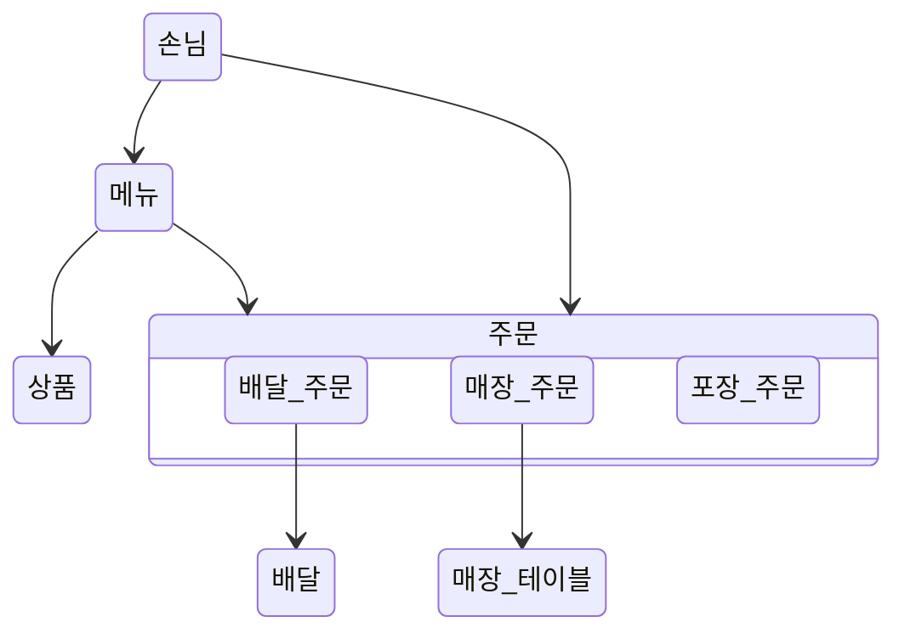

# 키친포스

## 퀵 스타트

```sh
cd docker
docker compose -p kitchenpos up -d
```

## 요구 사항

### 상품

- 상품을 등록할 수 있다.
- 상품의 가격이 올바르지 않으면 등록할 수 없다.
  - 상품의 가격은 0원 이상이어야 한다.
- 상품의 이름이 올바르지 않으면 등록할 수 없다.
  - 상품의 이름에는 비속어가 포함될 수 없다.
- 상품의 가격을 변경할 수 있다.
- 상품의 가격이 올바르지 않으면 변경할 수 없다.
  - 상품의 가격은 0원 이상이어야 한다.
- 상품의 가격이 변경될 때 메뉴의 가격이 메뉴에 속한 상품 금액의 합보다 크면 메뉴가 숨겨진다.
- 상품의 목록을 조회할 수 있다.

### 메뉴 그룹

- 메뉴 그룹을 등록할 수 있다.
- 메뉴 그룹의 이름이 올바르지 않으면 등록할 수 없다.
  - 메뉴 그룹의 이름은 비워 둘 수 없다.
- 메뉴 그룹의 목록을 조회할 수 있다.

### 메뉴

- 1 개 이상의 등록된 상품으로 메뉴를 등록할 수 있다.
- 상품이 없으면 등록할 수 없다.
- 메뉴에 속한 상품의 수량은 0 이상이어야 한다.
- 메뉴의 가격이 올바르지 않으면 등록할 수 없다.
  - 메뉴의 가격은 0원 이상이어야 한다.
- 메뉴에 속한 상품 금액의 합은 메뉴의 가격보다 크거나 같아야 한다.
- 메뉴는 특정 메뉴 그룹에 속해야 한다.
- 메뉴의 이름이 올바르지 않으면 등록할 수 없다.
  - 메뉴의 이름에는 비속어가 포함될 수 없다.
- 메뉴의 가격을 변경할 수 있다.
- 메뉴의 가격이 올바르지 않으면 변경할 수 없다.
  - 메뉴의 가격은 0원 이상이어야 한다.
- 메뉴에 속한 상품 금액의 합은 메뉴의 가격보다 크거나 같아야 한다.
- 메뉴를 노출할 수 있다.
- 메뉴의 가격이 메뉴에 속한 상품 금액의 합보다 높을 경우 메뉴를 노출할 수 없다.
- 메뉴를 숨길 수 있다.
- 메뉴의 목록을 조회할 수 있다.

### 주문 테이블

- 주문 테이블을 등록할 수 있다.
- 주문 테이블의 이름이 올바르지 않으면 등록할 수 없다.
  - 주문 테이블의 이름은 비워 둘 수 없다.
- 빈 테이블을 해지할 수 있다.
- 빈 테이블로 설정할 수 있다.
- 완료되지 않은 주문이 있는 주문 테이블은 빈 테이블로 설정할 수 없다.
- 방문한 손님 수를 변경할 수 있다.
- 방문한 손님 수가 올바르지 않으면 변경할 수 없다.
  - 방문한 손님 수는 0 이상이어야 한다.
- 빈 테이블은 방문한 손님 수를 변경할 수 없다.
- 주문 테이블의 목록을 조회할 수 있다.

### 주문

- 1개 이상의 등록된 메뉴로 배달 주문을 등록할 수 있다.
- 1개 이상의 등록된 메뉴로 포장 주문을 등록할 수 있다.
- 1개 이상의 등록된 메뉴로 매장 주문을 등록할 수 있다.
- 주문 유형이 올바르지 않으면 등록할 수 없다.
- 메뉴가 없으면 등록할 수 없다.
- 매장 주문은 주문 항목의 수량이 0 미만일 수 있다.
- 매장 주문을 제외한 주문의 경우 주문 항목의 수량은 0 이상이어야 한다.
- 배달 주소가 올바르지 않으면 배달 주문을 등록할 수 없다.
  - 배달 주소는 비워 둘 수 없다.
- 빈 테이블에는 매장 주문을 등록할 수 없다.
- 숨겨진 메뉴는 주문할 수 없다.
- 주문한 메뉴의 가격은 실제 메뉴 가격과 일치해야 한다.
- 주문을 접수한다.
- 접수 대기 중인 주문만 접수할 수 있다.
- 배달 주문을 접수되면 배달 대행사를 호출한다.
- 주문을 서빙한다.
- 접수된 주문만 서빙할 수 있다.
- 주문을 배달한다.
- 배달 주문만 배달할 수 있다.
- 서빙된 주문만 배달할 수 있다.
- 주문을 배달 완료한다.
- 배달 중인 주문만 배달 완료할 수 있다.
- 주문을 완료한다.
- 배달 주문의 경우 배달 완료된 주문만 완료할 수 있다.
- 포장 및 매장 주문의 경우 서빙된 주문만 완료할 수 있다.
- 주문 테이블의 모든 매장 주문이 완료되면 빈 테이블로 설정한다.
- 완료되지 않은 매장 주문이 있는 주문 테이블은 빈 테이블로 설정하지 않는다.
- 주문 목록을 조회할 수 있다.

## 용어 사전

### 상품

| 한글명 | 영문명 | 설명 |
| --- | --- | --- |
| 상품 | product | 메뉴를 관리하는 기준이 되는 데이터 |
| 이름 | displayed name | 음식을 상상하게 만드는 중요한 요소 |

### 메뉴

| 한글명 | 영문명 | 설명 |
| --- | --- | --- |
| 금액 | amount | 가격 * 수량 |
| 메뉴 | menu | 메뉴 그룹에 속하는 실제 주문 가능 단위 |
| 메뉴 그룹 | menu group | 각각의 메뉴를 성격에 따라 분류하여 묶어둔 그룹 |
| 메뉴 상품 | menu product | 메뉴에 속하는 수량이 있는 상품 |
| 숨겨진 메뉴 | not displayed menu | 주문할 수 없는 숨겨진 메뉴 |
| 이름 | displayed name | 음식을 상상하게 만드는 중요한 요소 |

### 매장 주문

| 한글명 | 영문명 | 설명 |
| --- | --- | --- |
| 방문한 손님 수 | number of guests | 식기가 필요한 사람 수. 필수 사항은 아니며 주문은 0명으로 등록할 수 있다. |
| 빈 테이블 | empty table | 주문을 등록할 수 없는 주문 테이블 |
| 서빙 | served | 조리가 완료되어 음식이 나갈 수 있는 단계 |
| 완료 | completed | 고객이 모든 식사를 마치고 결제를 완료한 단계 |
| 접수 | accepted | 주문을 받고 음식을 조리하는 단계 |
| 접수 대기 | waiting | 주문이 생성되어 매장으로 전달된 단계 |
| 주문 | order | 매장에서 식사하는 고객 대상. 손님들이 매장에서 먹을 수 있도록 조리된 음식을 가져다준다. |
| 주문 상태 | order status | 주문이 생성되면 매장에서 주문을 접수하고 고객이 음식을 받기까지의 단계를 표시한다. |
| 주문 테이블 | order table | 매장에서 주문이 발생하는 영역 |
| 주문 항목 | order line item | 주문에 속하는 수량이 있는 메뉴 |

### 배달 주문

| 한글명 | 영문명 | 설명 |
| --- | --- | --- |
| 배달 | delivering | 배달원이 매장을 방문하여 배달 음식의 픽업을 완료하고 배달을 시작하는 단계 |
| 배달 대행사 | delivery agency | 준비한 음식을 고객에게 직접 배달하는 서비스 |
| 배달 완료 | delivered | 배달원이 주문한 음식을 고객에게 배달 완료한 단계 |
| 서빙 | served | 조리가 완료되어 음식이 나갈 수 있는 단계 |
| 완료 | completed | 배달 및 결제 완료 단계 |
| 접수 | accepted | 주문을 받고 음식을 조리하는 단계 |
| 접수 대기 | waiting | 주문이 생성되어 매장으로 전달된 단계 |
| 주문 | order | 집이나 직장 등 고객이 선택한 주소로 음식을 배달한다. |
| 주문 상태 | order status | 주문이 생성되면 매장에서 주문을 접수하고 고객이 음식을 받기까지의 단계를 표시한다. |
| 주문 항목 | order line item | 주문에 속하는 수량이 있는 메뉴 |

### 포장 주문

| 한글명 | 영문명 | 설명 |
| --- | --- | --- |
| 서빙 | served | 조리가 완료되어 음식이 나갈 수 있는 단계 |
| 완료 | completed | 고객이 음식을 수령하고 결제를 완료한 단계 |
| 접수 | accepted | 주문을 받고 음식을 조리하는 단계 |
| 접수 대기 | waiting | 주문이 생성되어 매장으로 전달된 단계 |
| 주문 | order | 포장하는 고객 대상. 고객이 매장에서 직접 음식을 수령한다. |
| 주문 상태 | order status | 주문이 생성되면 매장에서 주문을 접수하고 고객이 음식을 받기까지의 단계를 표시한다. |
| 주문 항목 | order line item | 주문에 속하는 수량이 있는 메뉴 |


## 모델링

### 상품(Product)

- `Product`는 `Price`와 `DisplayedName`을 가진다

- `매장점주`는 `Product`를 등록 할 수 있다
  - `Price`는 0원 이상이어야 한다
  - `Name`은 비어 있을 수 없다
  - `Name`은 `profanity`을 포함할 수 없다

- `매장점주`는 `Product`의 `Price`를 변경할 수 있다

### 메뉴(Menu)

- `Menu`는 `DisplayedName`, `Price`, `MenuProducts` 그리고 `DisplayStatus`를 가진다

- `Menu`는 `MenuGroup`에 포함된다

- `매장점주`는 `Menu`를 등록할 수 있다
  - `Price`는 0원 이상이어야 한다
  - `Price`는 `MenuProduct`들의 가격 합보다 클 수 없다
  - `Name`은 비어 있을 수 없다
  - `Name`은 `profanity`을 포함할 수 없다
  - `MenuProduct`는 비어 있을 수 없다
    - `MenuProduct`의 `Product`는 매장에 등록된 `Product`이어야 한다
    - `MenuProduct`의 수량은 0개 이상이어야 한다

- `매장점주`는 `Menu`의 `Price`를 변경할 수 있다
  - `Price`는 0원 이상이어야 한다
  - `Price`가 `MenuProducts`의 `TotalPrice`보다 크다면 `hide` 상태가 된다

- `매장점주`는 `Menu`를 `display` 할수 있다
  - `Price`가 `MenuProducts`의 `TotalPrice`보다 크다면 `display`할 수 없다

- `매장점주`는 `Menu`를 `hide` 할수 있다

### 포장 주문(TakeOutOrder)
- `TakeOutOrder`는 `OrderStatus`, `OrderLineItems`, `OrderDateTime` 을 가진다

- `TakeOutOrder`의 흐름은 `접수 대기 중` -> `수락됨` -> `서빙` -> `계산 완료됨` 이다

- `고객`은 `TakeOutOrder`을 요청할 수 있다
  - `OrderLineItem`는 비어 있을 수 없다
    - `Price`과 수량을 가진다
    - 수량은 1개 이상이어야 한다
    - `Menu`는 `display` 상태이어야 한다
    - `Menu`는 매장 내 `Menu`의 가격과 일치하여야 한다

- `매장점주`는 `TakeOutOrder`를 수락할 수 있다
  - `TakeOutOrder`는 `접수 대기 중` 상태 이어야 한다

- `매장점주`는 `TakeOutOrder`를 포장 후 전달할 수 있다
  - `TakeOutOrder`는 `수락됨` 상태 이어야 한다

- `매장점주`는 `TakeOutOrder`를 계산 완료할 수 있다
  - - `TakeOutOrder`는 `서빙` 상태 이어야 한다

### 배달 주문(DeliveryOrder)

- `DeliveryOrder`는 `OrderStatus`, `OrderLineItems`, `OrderDateTime` 그리고 `DeliveryAddress` 을 가진다

- `DeliveryOrder`의 흐름은 `접수 대기 중` -> `수락됨` -> `서빙` -> `배달 중` -> `배달 완료` -> `계산 완료됨` 이다

- `DeliveryOrder`의 `OrderLineItem`의 수량은 1개 이상이어야 한다

- `고객`은 `DeliveryOrder`를 요청할 수 있다
  - `DeliveryAddress`는 비어 있을 수 없다
  - `OrderLineItem`는 비어 있을 수 없다
    - `Price`과 수량을 가진다
    - 수량은 1개 이상이어야 한다
    - `Menu`는 `display` 상태이어야 한다
    - `Menu`는 매장 내 `Menu`의 가격과 일치하여야 한다

- `매장점주`는 `DeliveryOrder`를 수락할 수 있다
  - `EatInOrder`는 `접수 대기 중` 상태 이어야 한다
  - `KitchenridersClient`에 배달을 요청한다

- `매장점주`는 `DeliveryOrder`를 `배달기사`에게 전달할 수 있다
  - `EatInOrder`는 `수락됨` 상태 이어야 한다

- `배달기사`는 `DeliveryOrder`의 배달을 시작할 수 있다
  - `EatInOrder`는 `서빙` 상태 이어야 한다

- `배달기사`는 `DeliveryOrder`의 배달을 완료할 수 있다
  - `EatInOrder`는 `배달 중` 상태 이어야 한다

- `매장점주`는 `DeliveryOrder`를 계산 완료할 수 있다
  - `DeliveryOrder`는 `배달 완료` 상태 이어야 한다

### 매장 식사 주문(EatInOrder)

- `EatInOrder`는 `OrderStatus`, `OrderLineItems`, `OrderDateTime` 그리고 `OrderTable` 을 가진다

- `EatInOrder`의 흐름은 `접수 대기 중` -> `수락됨` -> `서빙` -> `계산 완료됨` 이다

- `고객`은 `EatInOrder`를 요청할 수 있다
  - `OrderTable`는 이용 가능한 상태이어야 한다
  - `OrderLineItem`는 비어 있을 수 없다
    - `Price`과 수량을 가진다
    - 수량을 1개 미만으로 설정하여서 취소할 수 있다
    - `Menu`는 `display` 상태이어야 한다
    - `Menu`는 매장 내 `Menu`의 가격과 일치하여야 한다

- `매장점주`는 `EatInOrder`를 수락할 수 있다
  - `EatInOrder`는 `접수 대기 중` 상태 이어야 한다

- `매장점주`는 `EatInOrder`를 매장 테이블로 전달할 수 있다
  - `EatInOrder`는 `수락됨` 상태 이어야 한다

- `매장점주`는 `EatInOrder`를 계산 완료할 수 있다
  - `EatInOrder`는 `서빙` 상태 이어야 한다
  - `OrderTable`을 다시 손님을 받을 수 있도록 정리한다

## Value Objects

### 공개 이름(DisplayedName)

- `DisplayedName`은 1자 이상의 문자를 가진다
  - `DisplayedName`은 `PurgomalumClient`을 통해 비속어 여부를 검사를 한다

### 가격(Price)

- `Price`는 0원 이상의 정수를 가진다
- `Product`나 `Menu`의 `Price`를 변경하면 `MenuPriceValidator`를 통해 `Menu`의 `DisplayStatus`를 변경한다

### 전체 구성품 (MenuProducts)

- `MenuProducts`는 `Menu`에 포함된 모든 `MenuProduct` 가진다
- `MenuProducts`에서 전체 구성품의 `TotalPrice`를 생성한다

## 도메인 모델


