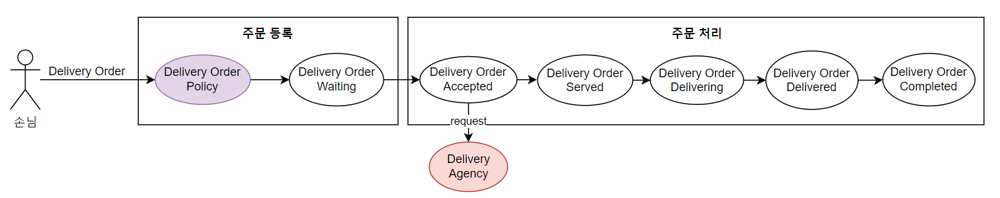
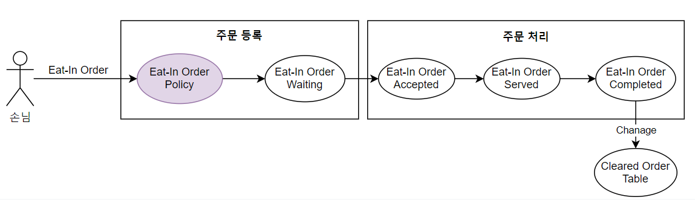
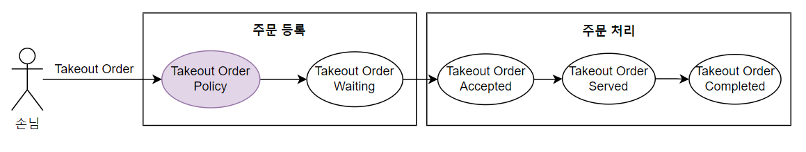

# 키친포스

## 퀵 스타트

```sh
cd docker
docker compose -p kitchenpos up -d
```

## 요구 사항

### 상품

- 상품을 등록할 수 있다.
- 상품의 가격이 올바르지 않으면 등록할 수 없다.
  - 상품의 가격은 0원 이상이어야 한다.
- 상품의 이름이 올바르지 않으면 등록할 수 없다.
  - 상품의 이름에는 비속어가 포함될 수 없다.
- 상품의 가격을 변경할 수 있다.
- 상품의 가격이 올바르지 않으면 변경할 수 없다.
  - 상품의 가격은 0원 이상이어야 한다.
- 상품의 가격이 변경될 때 메뉴의 가격이 메뉴에 속한 상품 금액의 합보다 크면 메뉴가 숨겨진다.
- 상품의 목록을 조회할 수 있다.

### 메뉴 그룹

- 메뉴 그룹을 등록할 수 있다.
- 메뉴 그룹의 이름이 올바르지 않으면 등록할 수 없다.
  - 메뉴 그룹의 이름은 비워 둘 수 없다.
- 메뉴 그룹의 목록을 조회할 수 있다.

### 메뉴

- 1 개 이상의 등록된 상품으로 메뉴를 등록할 수 있다.
- 상품이 없으면 등록할 수 없다.
- 메뉴에 속한 상품의 수량은 0 이상이어야 한다.
- 메뉴의 가격이 올바르지 않으면 등록할 수 없다.
  - 메뉴의 가격은 0원 이상이어야 한다.
- 메뉴에 속한 상품 금액의 합은 메뉴의 가격보다 크거나 같아야 한다.
- 메뉴는 특정 메뉴 그룹에 속해야 한다.
- 메뉴의 이름이 올바르지 않으면 등록할 수 없다.
  - 메뉴의 이름에는 비속어가 포함될 수 없다.
- 메뉴의 가격을 변경할 수 있다.
- 메뉴의 가격이 올바르지 않으면 변경할 수 없다.
  - 메뉴의 가격은 0원 이상이어야 한다.
- 메뉴에 속한 상품 금액의 합은 메뉴의 가격보다 크거나 같아야 한다.
- 메뉴를 노출할 수 있다.
- 메뉴의 가격이 메뉴에 속한 상품 금액의 합보다 높을 경우 메뉴를 노출할 수 없다.
- 메뉴를 숨길 수 있다.
- 메뉴의 목록을 조회할 수 있다.

### 주문 테이블

- 주문 테이블을 등록할 수 있다.
- 주문 테이블의 이름이 올바르지 않으면 등록할 수 없다.
  - 주문 테이블의 이름은 비워 둘 수 없다.
- 빈 테이블을 해지할 수 있다.
- 빈 테이블로 설정할 수 있다.
- 완료되지 않은 주문이 있는 주문 테이블은 빈 테이블로 설정할 수 없다.
- 방문한 손님 수를 변경할 수 있다.
- 방문한 손님 수가 올바르지 않으면 변경할 수 없다.
  - 방문한 손님 수는 0 이상이어야 한다.
- 빈 테이블은 방문한 손님 수를 변경할 수 없다.
- 주문 테이블의 목록을 조회할 수 있다.

### 주문

- 1개 이상의 등록된 메뉴로 배달 주문을 등록할 수 있다.
- 1개 이상의 등록된 메뉴로 포장 주문을 등록할 수 있다.
- 1개 이상의 등록된 메뉴로 매장 주문을 등록할 수 있다.
- 주문 유형이 올바르지 않으면 등록할 수 없다.
- 메뉴가 없으면 등록할 수 없다.
- 매장 주문은 주문 항목의 수량이 0 미만일 수 있다.
- 매장 주문을 제외한 주문의 경우 주문 항목의 수량은 0 이상이어야 한다.
- 배달 주소가 올바르지 않으면 배달 주문을 등록할 수 없다.
  - 배달 주소는 비워 둘 수 없다.
- 빈 테이블에는 매장 주문을 등록할 수 없다.
- 숨겨진 메뉴는 주문할 수 없다.
- 주문한 메뉴의 가격은 실제 메뉴 가격과 일치해야 한다.
- 주문을 접수한다.
- 접수 대기 중인 주문만 접수할 수 있다.
- 배달 주문을 접수되면 배달 대행사를 호출한다.
- 주문을 서빙한다.
- 접수된 주문만 서빙할 수 있다.
- 주문을 배달한다.
- 배달 주문만 배달할 수 있다.
- 서빙된 주문만 배달할 수 있다.
- 주문을 배달 완료한다.
- 배달 중인 주문만 배달 완료할 수 있다.
- 주문을 완료한다.
- 배달 주문의 경우 배달 완료된 주문만 완료할 수 있다.
- 포장 및 매장 주문의 경우 서빙된 주문만 완료할 수 있다.
- 주문 테이블의 모든 매장 주문이 완료되면 빈 테이블로 설정한다.
- 완료되지 않은 매장 주문이 있는 주문 테이블은 빈 테이블로 설정하지 않는다.
- 주문 목록을 조회할 수 있다.

## 용어 사전
### 상품
| 한글명   | 영문명           | 설명                    |
|-------|---------------|-----------------------|
| 상품    | Product       | 판매될 수 있는 물리적 제품       |
| 상품 가격 | Product Price | 상품을 구매하기 위해 지불해야하는 금액 |
| 상품 이름 | Product Name  | 상품을 식별하기 위한 명칭        |
| 비속어   | Black Word    | 부적절한 내용               |

### 메뉴
| 한글명      | 영문명                | 설명                      |
|----------|--------------------|-------------------------|
| 메뉴 그룹    | Menu Group         | 여러 메뉴들을 특정 기준으로 묶은 모음   |
| 메뉴 그룹 이름 | Menu Group Name    | e.g. 세트A, 나홀로 메뉴, 셋트 메뉴 |
| 메뉴       | Menu               | 손님이 구매할 수 있는 최소 단위      |
| 메뉴 이름    | Menu Name          | 메뉴 상품들을 대표하는 명칭         |
| 메뉴 가격    | Menu Price         | 손님이 지불해야될 금액            |
| 메뉴 상품    | Menu Product       | 손님에게 제공하는 제품            |
| 메뉴 상품 가격 | Menu Product Price | 손님에게 제공하는 제품 가격         |
| 메뉴 상품 개수 | Menu Product Count | 손님에게 제공되는 제품 수량         |
| 노출 메뉴    | Displayed Menu     | 손님에게 메뉴가 노출된 상태         |
| 숨김 메뉴    | Hide Menu          | 손님에게 메뉴가 숨겨진 상태         |
| 비속어      | Black Word         | 부적절한 내용                 |

### 주문

#### 배달 주문
| 한글명       | 영문명                       | 설명                           |
|-----------|---------------------------|------------------------------|
| 배달 주문     | Delivery Order            | 손님이 구매한 메뉴를 지정된 목적지로 전달하여 제공 |
| 주문 항목     | Order Line Item           | 손님이 구매 요청한 메뉴 모음             |
| 배달 주문 대기  | Delivery Order Waiting    | 배달 주문이 요청된 상태                |
| 배달 주문 접수  | Delivery Order Accepted   | 배달 주문이 접수된 상태                |
| 배달 주문 제공  | Delivery Order Served     | 배달 주문 메뉴가 전달될 준비가된 상태        |
| 배달 주문 배달중 | Delivery Order Delivering | 배달 주문 메뉴가 전달중인 상태            |
| 배달 주문 배달완료 | Delivery Order Delivered  | 배달 주문 메뉴가 전달이 완료된 상태         |
| 주문 완료     | Delivery Order Completed  | 배달 주문이 완료된 상태                |
| 배달 주소     | Delivery Address          | 손님이 구매한 메뉴를 전달할 목적지          |
| 배달업체      | Delivery Agency           | 손님이 구매한 메뉴를 전달하는 업체          |

#### 매장 주문
| 한글명         | 영문명                    | 설명                              |
|-------------|------------------------|---------------------------------|
| 매장 주문       | Eat-In Order           | 손님이 구매한 메뉴를 지정된 주문 테이블로 전달하여 제공 |
| 주문 항목       | Order Line Item        | 손님이 구매 요청한 메뉴 모음                |
| 매장 주문 대기    | Eat-In Order Waiting   | 매장 주문이 요청된 상태                   |
| 매장 주문 접수    | Eat-In Order Accepted  | 매장 주문이 접수된 상태                   |
| 매장 주문 제공    | Eat-In Order Served    | 매장 주문 메뉴가 제공된 상태                |
| 매장 주문 완료    | Eat-In Order Completed | 매장 주문이 완료된 상태                   |
| 주문 테이블      | Order Table            | 매장 주문 손님이 사용하는 테이블              |
| 주문 테이블 이름   | Order Table Name       | e.g. 1번 테이블, 2번 테이블, 3번 테이블     |
| 사용중인 주문 테이블 | Occupied Order Table   | 손님이 사용중인 테이블                    |
| 빈 주문 테이블    | Cleared Order Table    | 손님이 사용중이지 않은 테이블                |
| 손님          | Guest                  | 매장 주문을 이용하는 손님                  |

#### 포장 주문
| 한글명      | 영문명                     | 설명                  |
|----------|-------------------------|---------------------|
| 포장 주문    | Takeout Order           | 손님이 구매한 메뉴를 포장하여 제공 |
| 주문 항목    | Order Line Item         | 손님이 구매 요청한 메뉴 모음    |
| 포장 주문 대기 | Takeout Order Waiting   | 포장 주문이 요청된 상태       |
| 포장 주문 접수 | Takeout Order Accepted  | 포장 주문이 접수된 상태       |
| 포장 주문 제공 | Takeout Order Served    | 포장 주문 메뉴가 제공된 상태    |
| 포장 주문 완료 | Takeout Order Completed | 포장 주문이 완료된 상태       |


## 모델링
### 상품
#### 속성
- `Product`는 `Product Name`, `Product Price`를 가진다.
  - `Product Price`은 0원 이상이어야 한다.
  - `Product Name`은 `Black Word`가 포함되면 안된다.
  - `Product Name`은 Null 이면 안된다.

#### 행위
- `Product`를 등록할 수 있다.
  - `Product`의 모든 속성의 비즈니스 규칙을 만족하지 못하면 등록할 수 없다.
- 등록된 `Product`의 `Product Price`를 변경할 수 있다.
  - `Product Price` 속성의 비즈니스 규칙을 만족하지 못하면 변경할 수 없다.
  - `Product`가 `Menu`에 포함된 경우, `Menu Product`의 `Product Price`도 변경된다.
- 등록된 `Product` 목록을 조회할 수 있다.

### 메뉴 그룹
#### 속성
- `Menu Group`는 `Menu Group Name`를 가진다.
  - `Menu Group Name`은 널이거나 빈 값이면 등록할 수 없다.

#### 행위
- `Menu Group`을 등록할 수 있다.
  - `Menu Group`의 모든 속성의 비즈니스 규칙을 만족하지 못하면 등록할 수 없다.
- 등록된 `Menu Group` 목록을 조회할 수 있다.

### 메뉴
#### 속성
- `Menu`는 `Menu Group`, `Menu Name`, `Menu Price`, `Menu Product`를 가진다.
  - `Menu Price`는 0원 이상이어야 한다.
  - `Menu Name`은 `Black Word`가 포함되면 안된다.
  - `Menu Name`은 Null 이면 안된다.
  - `Menu Product`의 수량은 0 이상이어야 한다.
    - `Menu Product`로 등록하려면, `Product`로 등록돼야한다.
  - `Menu Price`는 `Menu Product Price`의 합 보다 크면 안된다.

#### 행위
- `Menu`를 등록할 수 있다.
  - `Menu`의 모든 속성의 비즈니스 규칙을 만족하지 못하면 등록할 수 없다.
- 등록된 `Menu`의 `Menu Price`를 변경할 수 있다.
  - `Menu Price`, `Menu Product Price` 속성의 비즈니스 규칙을 만족하지 못하면 변경할 수 없다.
- 등록된 `Menu`를 `Displayed Menu`로 변경할 수 있다.
  - `Menu Price`, `Menu Product Price` 속성의 비즈니스 규칙을 만족하지 못하면 변경할 수 없다.
- 등록된 `Menu`를 `Hide Menu`로 변경할 수 있다.
- `Menu`의 `Menu Price`가 `Menu Product`의 `Product Price`의 합보다 크면 `Hide Menu`가 된다.
- 등록된 `Menu` 목록을 조회할 수 있다.

### 배달 주문(Delivery Order)


#### 속성
- `Delivery Order`는, `Order Line Item`, `Delivery Address`를 가진다.
  - `Order Line Item`의 개수는 0개 이상이어야 한다.
  - `Order Line Item`는 `Menu`가 존재해야 한다.
  - `Order Line Item`는 `Hide Menu`이면 안된다.
  - `Order Line Item`의 `Menu Price`는 등록된 `Menu`의 `Menu Price`와 일치해야 한다.
  - `Delivery Address`는 빈 값이면 안된다.

#### 행위
- `Delivery Order`을 등록할 수 있다.
  - `Delivery Order`의 모든 속성의 비즈니스 규칙을 만족하지 못하면 등록할 수 없다.
- 등록된 `Delivery Order`가 `Delivery Order Waiting`이면, `Delivery Order Accepted`로 변경할 수 있다.
- `Delivery Order Accepted`이면, `Delivery Agency`를 호출한다.
- 등록된 `Delivery Order`가 `Delivery Order Accepted`이면, `Delivery Order Served`로 변경할 수 있다.
- 등록된 `Delivery Order`가 `Delivery Order Served`이면, `Delivery Order Delivering`로 변경할 수 있다.
- 등록된 `Delivery Order`가 `Delivery Order Delivering`이면, `Delivery Order Delivered`로 변경할 수 있다.
- 등록된 `Delivery Order`가 `Delivery Order Delivered`이면, `Delivery Order Completed`로 변경할 수 있다.

### 매장 주문(Eat-In Order) 및 주문 테이블(Order Table)


#### 속성
- `Order Table`는 `Order Table Name`, `Guest`를 가진다.
  - `Order Table Name`은 널이거나 빈 값이면 등록할 수 없다.
  - `Guest` 수는 0 이상이어야 한다.(기본 값은 0이다)


- `Eat-In Order`는 `Order Line Item`, `Order Table`를 가진다.
  - `Order Line Item`의 개수는 정수만 가능하다.
  - `Order Line Item`는 `Menu`가 존재해야 한다.
  - `Order Line Item`는 `Hide Menu`이면 안된다.
  - `Order Line Item`의 `Menu Price`는 등록된 `Menu`의 `Menu Price`와 일치해야 한다.
  - `Order Table`이 존재하지 않으면 안된다.
  - `Order Table`이 `Cleared Order Table`이면 안된다.

#### 행위
- `Order Table`을 등록할 수 있다.
  - `Order Table`의 모든 속성의 비즈니스 규칙을 만족하지 못하면 등록할 수 없다.
- 등록된 `Order Table`을 `Occupied Order Table`로 변경할 수 있다.
- 등록된 `Order Table`을 `Cleared Order Table`로 변경할 수 있다.
  - `Order Table`의 `Order`가 `Eat-In Order Complete`가 아니면 변경할 수 없다.
- `Order Table`의 `Guest` 수를 변경할 수 있다.
  - `Guest` 속성의 비즈니스 규칙을 만족하지 못하면 변경할 수 없다.
  - `Cleared Order Table`인 경우 변경할 수 없다.
- 등록된 `Order Table` 목록을 조회할 수 있다.


- `Eat-In Order`을 등록할 수 있다.
  - `Eat-In Order`의 모든 속성의 비즈니스 규칙을 만족하지 못하면 등록할 수 없다.
- 등록된 `Eat-In Order`가 `Eat-In Order Waiting`이면, `Delivery Order Accepted`로 변경할 수 있다.
- 등록된 `Eat-In Order`가 `Eat-In Order Accepted`이면, `Delivery Order Served`로 변경할 수 있다.
- 등록된 `Eat-In Order`가 `Eat-In Order Served`이면, `Delivery Order Completed`로 변경할 수 있다.
- `Eat-In Order Completed`이면, `Order Table`을 `Cleared Order Table`로 변경할 수 있다.

### 포장 주문(Takeout Order)


#### 속성
- `Takeout Order`는 `Order Line Item`를 가진다.
  - `Order Line Item`의 개수는 0개 이상이어야 한다.
  - `Order Line Item`는 `Menu`가 존재해야 한다.
  - `Order Line Item`는 `Hide Menu`이면 안된다.
  - `Order Line Item`의 `Menu Price`는 등록된 `Menu`의 `Menu Price`와 일치해야 한다.

#### 행위
- `Takeout Order`을 등록할 수 있다.
  - `Takeout Order`의 모든 속성의 비즈니스 규칙을 만족하지 못하면 등록할 수 없다.
- 등록된 `Takeout Order`가 `Takeout Order Waiting`이면, `Takeout Order Accepted`로 변경할 수 있다.
- 등록된 `Takeout Order`가 `Takeout Order Accepted`이면, `Takeout Order Served`로 변경할 수 있다.
- 등록된 `Takeout Order`가 `Takeout Order Served`이면, `Takeout Order Completed`로 변경할 수 있다.
