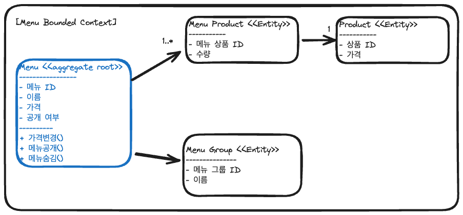
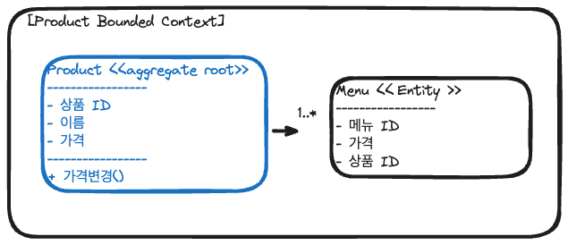
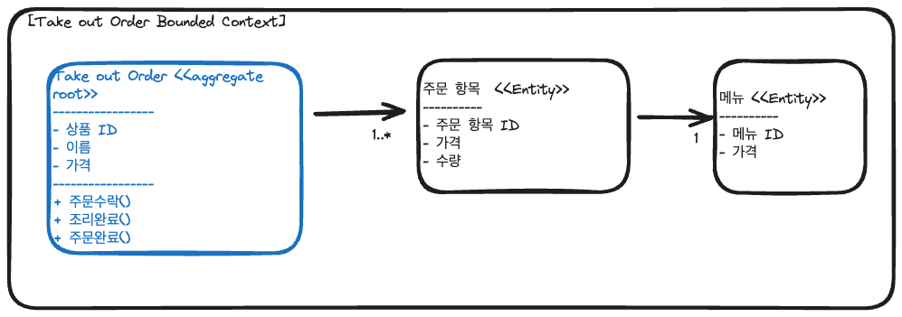
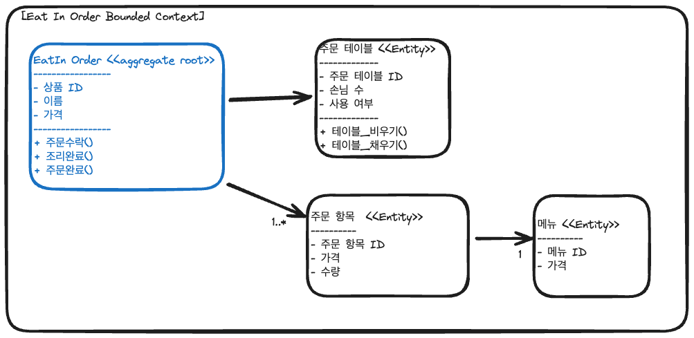
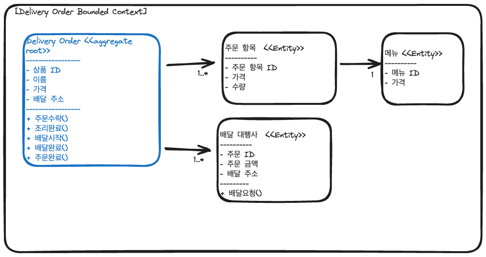

# 키친포스

## 퀵 스타트

```sh
cd docker
docker compose -p kitchenpos up -d
```

## 요구 사항

- 메뉴
    - 생성
        - [ ] 사용자는 `메뉴`를 생성할 수 있다.
        - [ ] `메뉴` 생성 시, `메뉴 이름`, `메뉴 가격`, `메뉴 그룹`, `메뉴 상품`들을 지정해야 한다.
        - `메뉴 생성 정책`
            - [ ] `메뉴`는 특정 `메뉴 그룹`에 속해야 한다.
            - [ ] `메뉴`는 1개 이상의 `메뉴 상품`을 포함해야 한다.
            - [ ] 지정한 `메뉴 상품` 중 하나라도 `상품`이 존재하지 않으면 생성할 수 없다.
    - `메뉴 이름 정책`
        - [ ] `메뉴`의 `메뉴 이름`은 비어있을 수 없다.
        - [ ] `메뉴`의 `메뉴 이름`은 `비속어`를 포함할 수 없다.
    - `메뉴 가격 정책`
        - [ ] `메뉴`의 `메뉴 가격`은 0 이상이어야 한다.
        - [ ] `메뉴`의 가격 이 `메뉴 상품`들의 가격 총합을 초과할 수 없다.
    - `숨긴 메뉴`
        - [ ] 사용자는 `메뉴`를 노출시킬 수 있다.
    - `노출 메뉴`
        - [ ] 사용자는 `메뉴`를 노출시킬 수 있다.
        - `메뉴 노출 정책`
            - [ ] `메뉴` 노출 시, `메뉴`의 가격이 `메뉴 상품`들의 가격 총합을 초과하면 안된다.
    - 메뉴 조회
        - [ ] 사용자는 모든 `메뉴`를 조회할 수 있다.
    - 메뉴 가격 변경
        - [ ] 사용자는 `메뉴`의 가격을 변경할 수 있다.

- 메뉴 그룹
    - `메뉴 그룹 이름 정책`
        - [ ] `메뉴 그룹 이름`은 비어있을 수 없다.
    - 생성
        - [ ] 사용자는 `메뉴 그룹`을 생성할 수 있다.
        - `메뉴 그룹 생성 정책`
            - [ ] `메뉴 그룹` 생성 시, `메뉴 그룹 이름`을 지정해야 한다.
    - 조회
        - [ ] 사용자는 모든 `메뉴 그룹`을 조회할 수 있다.

- 상품
    - `상품 이름 정책`
        - [ ] `상품 이름`은 비어있을 수 없다.
        - [ ] `상품 이름`은 비속어를 포함할 수 없다.
    - `상품 가격 정책`
        - [ ] `상품 가격`은 0 이상이어야 한다.
    - 생성
        - [ ] 사용자는 `상품`을 생성할 수 있다.
        - `상품 생성 정책`
            - [ ] `상품` 생성 시, `상품 이름`과 `상품 가격` 을 지정해야 한다.
    - 상품 가격 변경
        - [ ] 사용자는 `상품 가격`을 변경할 수 있다.
        - [ ] `상품 가격`이 변경되면, 해당 `상품`을 포함하는 모든 `메뉴`는 `상품 가격 변경 정책`에 따라 노출 여부가 결정된다.
        - [ ] 변경된 `상품 가격` 기준으로 `상품 가격 변경 정책`을 만족하지 못하면, 해당 `메뉴`는 숨김 처리한다.
            - `상품 가격 변경 정책`
                - `상품`의 가격이 변경되어, `상품`이 포함된 기존 `메뉴` 가격보다 낮아야 한다.
    - 조회
        - [ ] 사용자는 모든 `상품`을 조회할 수 있다.


- `주문`
    - 공통 사항
        - [ ] `주문`은 `주문 상태`, `주문 유형` 을 가진다.
        - [ ] `주문`은 하나 이상의 `주문 항목(OrderLineItem)`을 포함해야 한다.
    - `주문 항목` (OrderLineItem)
        - `주문 항목 정책`
            - [ ] `주문 항목`은 `메뉴`, `수량`, `주문 항목 가격`을 포함해야 한다.
            - [ ] `주문 항목`은 `주문`에 속해야 한다.
            - [ ] `주문 항목`에 포함된 모든 `메뉴` 는 존재해야하며 요청된 `주문 항목`의 수와 `메뉴`의 수는 일치해야 한다.
            - [ ] `주문 항목`에 포함된 `메뉴`는 노출 상태여야 한다.
            - [ ] `주문 항목`의 `주문 항목 가격`은 해당 `메뉴 가격`과 일치해야 한다.
    - `배달 주문`
        - `배달 주문 생성 정책`
            - [ ] `배달 주문` 은 `배송 주소`가 필요하다.
            - [ ] `주문 항목`의 수량은 0 이상이어야 한다.
        - `배송 주소 정책`
            - [ ] `배송 주소`는 비어있을 수 없다.
    - `포장 주문`
        - `포장 주문 생성 정책`
            - [ ] `주문 항목`의 수량은 0 이상이어야 한다.
    - `매장 주문`
        - `매장 주문 생성 정책`
            - [ ] `매장 주문`은 `주문 테이블`을 제공해야 한다.
            - [ ] 비어 있는 `주문 테이블`을 제공해야 한다.

    - `주문 수락`
        - [ ] 사용자는 `주문`을 수락할 수 있다.
        - `주문 수락 정책`
            - [ ] `주문 유형`이 `배달`(DELIVERY)인 경우, `주문 항목` 들의 가격 총합과 함께 `배달 요청`을 해야 한다.
            - [ ] `주문 상태`는 `주문 대기`(WAITING) -> `주문 수락`(ACCEPTED) 의 순서대로 변경된다.
    - `조리 완료` (SERVE)
        - [ ] 사용자는 `주문`을 `조리 완료`로 변경할 수 있다.
        - `조리 완료 정책`
            - [ ] `주문 상태`는 `수락됨`(ACCEPTED) -> `조리 완료`(SERVED) 의 순서대로 변경된다.
    - `배달 시작`
        - [ ] 사용자는 `주문`을 `배달`을 시작할 수 있다.
        - `배달 시작 정책`
            - [ ] `주문 유형`이 `배달`(DELIVERY) 이어야 한다.
            - [ ] `주문 상태`는 `서빙됨`(SERVED) -> `배달중`(DELIVERING) 의 순서대로 변경된다.
    - `배달 완료`
        - [ ] 사용자는 `주문`의 배달을 완료할 수 있다.
        - `배달 완료 정책`
            - [ ] `주문 상태`는 `배달중`(DELIVERING) -> `배달완료`(DELIVERED) 의 순서대로 변경된다.
    - `주문 완료`
        - [ ] 사용자는 `주문`을 완료할 수 있다.
        - `주문 완료 정책`
            - [ ] `주문 유형`이 `배달`(DELIVERY)인 경우, `주문`의 상태가 `배달완료`(DELIVERED) -> `완료됨`(COMPLETED) 의
              순서대로 변경된다.
            - [ ] `주문 유형`이 `포장`(TAKEOUT) 또는 `매장식사`(EAT_IN)인 경우, `주문 상태`가 `서빙됨`(SERVED) -> `완료됨`(
              COMPLETED)
              의 순서대로 변경된다.
            - [ ] `주문 유형`이 `매장식사`(EAT_IN)인 경우, `주문 테이블`을 `테이블 비우기` 해준다.
    - 조회
        - [ ] 사용자는 모든 `주문`을 조회할 수 있다.

- `주문 테이블`
    - 생성
        - `주문 테이블 생성 정책`
            - [ ] 사용자는 `주문 테이블`을 생성할 수 있다.
            - [ ] `주문 테이블` 생성 시, `주문 테이블 이름`을 지정해야 한다.
    - `주문 테이블 이름 정책`
        - [ ] `주문 테이블 이름`은 비어있을 수 없다.
    - 착석
        - [ ] 사용자는 `주문 테이블`에 착석할 수 있다.
        - [ ] `주문 테이블`은 존재해야 한다.
        - [ ] `주문 테이블`의 `사용중 상태`를 `착석 상태`로 변경해야 한다.
    - 테이블 비우기
        - `테이블 비우기 정책`
            - [ ] 사용자는 `주문 테이블`을 초기화할 수 있다.
            - [ ] `주문 테이블`은 존재해야 한다.
            - [ ] `주문 테이블`에 완료되지 않은 `주문`이 존재하면 안된다.
            - [ ] `주문 테이블`의 `손님` 수를 0으로 설정해야 한다.
            - [ ] `주문 테이블`의 `사용중 상태`를 `빈 상태`로 변경해야 한다.
    - 손님 수 변경
        - `손님 수 변경 정책`
            - [ ] 사용자는 `주문 테이블`의 `손님` 수를 변경할 수 있다.
            - [ ] `주문 테이블`은 존재해야 한다.
            - [ ] 변경하려는 `손님` 수는 0 이상이어야 한다.
            - [ ] `주문 테이블`이 착석 상태가 아니라면 `손님` 수를 변경할 수 없다.
    - 조회
        - [ ] 사용자는 모든 `주문 테이블`을 조회할 수 있다.

## 용어 사전

### 공통

| 한글명 | 영문명       | 설명              |
|-----|-----------|-----------------|
| 비속어 | Profanity | 비속어는 비속어를 나타낸다. |

### 메뉴

| 한글명      | 영문명             | 설명                                |
|----------|-----------------|-----------------------------------|
| 메뉴       | Menu            | 메뉴는 메뉴 그룹에 속하며, 메뉴 상품들을 포함한다.     |
| 메뉴 상품    | MenuProduct     | 메뉴 상품은 상품과 수량을 포함한다.              |
| 메뉴 이름    | MenuName        | 메뉴 이름은 메뉴를 식별하는 이름이다.             |
| 메뉴 가격    | MenuPrice       | 메뉴 가격은 메뉴의 가격이다.                  |
| 메뉴 가격 정책 | MenuPricePolicy | 메뉴 가격 정책은 메뉴의 가격이 올바른지 검증하는 정책이다. |
| 숨김 메뉴    | HiddenMenu      | 숨김 메뉴는 노출되지 않는 메뉴이다.              |
| 노출 메뉴    | ExposedMenu     | 노출 메뉴는 노출되는 메뉴이다.                 |

### 메뉴 그룹

| 한글명      | 영문명           | 설명                          |
|----------|---------------|-----------------------------|
| 메뉴 그룹    | MenuGroup     | 메뉴 그룹은 메뉴를 분류하는 단위이다.       |
| 메뉴 그룹 이름 | MenuGroupName | 메뉴 그룹 이름은 메뉴 그룹을 식별하는 이름이다. |

### 상품

| 한글명   | 영문명          | 설명                    |
|-------|--------------|-----------------------|
| 상품    | Product      | 상품은 상품 이름과 가격을 포함한다.  |
| 상품 이름 | ProductName  | 상품 이름은 상품을 식별하는 이름이다. |
| 상품 가격 | ProductPrice | 상품 가격은 상품의 가격이다.      |

### 주문

| 한글명      | 영문명                | 설명                           |
|----------|--------------------|------------------------------|
| 주문       | Order              | 주문은 주문 테이블과 주문 상품들을 포함한다.    |
| 주문 상태    | OrderStatus        | 주문 상태는 주문의 상태를 나타낸다.         |
| 주문 대기    | OrderWaiting       | 주문 대기는 주문이 대기 중인 것을 나타낸다.    |
| 주문 수락    | OrderAccepted      | 주문 수락은 주문을 수락하는 것을 나타낸다.     |
| 조리 완료    | OrderServed        | 조리 완료는 주문을 조리 완료하는 것을 나타낸다.  |
| 주문 배달중   | OrderDelivering    | 주문 배달중은 주문이 배달 중인 것을 나타낸다.   |
| 주문 배달 완료 | OrderDelivered     | 주문 배달완료는 주문이 배달 완료된 것을 나타낸다. |
| 주문 완료    | OrderCompleted     | 주문 완료는 주문이 완료된 것을 나타낸다.      |
| 주문 유형    | OrderType          | 주문 유형은 주문의 유형을 나타낸다.         |
| 배달       | Delivery           | 배달은 배달 주문 유형을 나타낸다.          |
| 포장       | Takeout            | 포장은 포장 주문 유형을 나타낸다.          |
| 매장 식사    | EatIn              | 매장식사는 매장 주문 유형을 나타낸다.        |
| 주문 항목    | OrderLineItem      | 주문 항목은 메뉴와 수량을 포함한다.         |
| 주문 항목 가격 | OrderLineItemPrice | 주문 항목 가격은 주문 항목의 가격이다.       |

#### 포장 주문

| 한글명   | 영문명          | 설명    |
|-------|--------------|-------|
| 포장 주문 | TakeoutOrder | 포장 주문 |

#### 배달 주문

| 한글명    | 영문명             | 설명                          |
|--------|-----------------|-----------------------------|
| 배달 주문  | DeliveryOrder   | 배달 주문은 배달 주소를 포함한다.         |
| 배송 주소  | DeliveryAddress | 배송 주소는 배달 주소를 나타낸다.         |
| 배달 요청  | DeliveryRequest | 배달 요청은 배달 요청을 나타낸다.         |
| 배달 대행사 | DeliveryAgency  | 배달 대행사는 배달을 대행하는 대행사를 나타낸다. |
| 라이더    | Rider           | 라이더는 배달을 수행하는 라이더를 나타낸다.    |

#### 매장 주문

| 한글명       | 영문명             | 설명                             |
|-----------|-----------------|--------------------------------|
| 매장 주문     | EatInOrder      | 매장 주문                          |
| 주문 테이블    | OrderTable      | 주문 테이블은 주문을 받는 테이블이다.          |
| 주문 테이블 이름 | OrderTableName  | 주문 테이블 이름은 주문 테이블을 식별하는 이름이다.  |
| 테이블 비우기   | OrderTableClear | 테이블 비우기는 주문 테이블을 비우는 것을 나타낸다.  |
| 손님        | Guest           | 손님은 주문 테이블에 착석한 손님을 나타낸다.      |
| 사용중 상태    | InUseStatus     | 사용중 상태는 주문 테이블이 사용중인 상태를 나타낸다. |
| 빈 상태      | EmptyStatus     | 빈 상태는 주문 테이블이 빈 상태를 나타낸다.      |

## 모델링

### 우리가 해결해야할 영역 (Bounded Context)

- 메뉴
- 상품
- 포장 주문
- 매장 주문
- 배달 주문

### BC : 메뉴



### BC : 상품



### BC : 포장 주문



### BC : 매장 주문


 
### BC : 배달 주문


