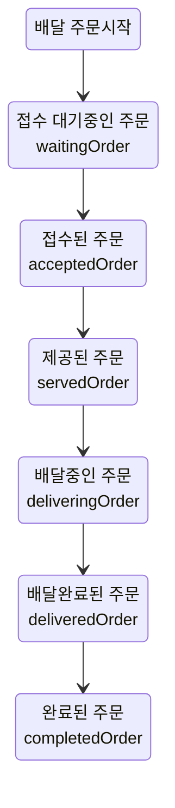
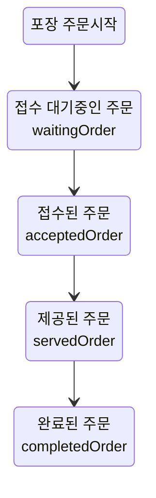
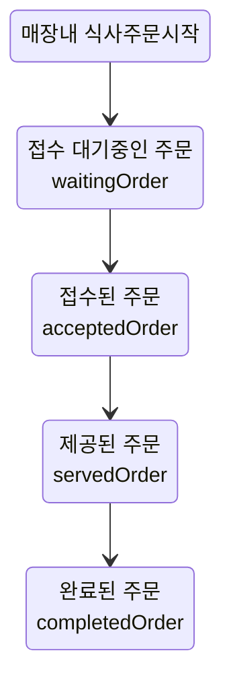

# 키친포스

## 퀵 스타트

```sh
cd docker
docker compose -p kitchenpos up -d
```

## 요구 사항

### 상품

- 상품을 등록할 수 있다.
- 상품의 가격이 올바르지 않으면 등록할 수 없다.
    - 상품의 가격은 0원 이상이어야 한다.
- 상품의 이름이 올바르지 않으면 등록할 수 없다.
    - 상품의 이름에는 비속어가 포함될 수 없다.
- 상품의 가격을 변경할 수 있다.
- 상품의 가격이 올바르지 않으면 변경할 수 없다.
    - 상품의 가격은 0원 이상이어야 한다.
- 상품의 가격이 변경될 때 메뉴의 가격이 메뉴에 속한 상품 금액의 합보다 크면 메뉴가 숨겨진다.
- 상품의 목록을 조회할 수 있다.

### 메뉴 그룹

- 메뉴 그룹을 등록할 수 있다.
- 메뉴 그룹의 이름이 올바르지 않으면 등록할 수 없다.
    - 메뉴 그룹의 이름은 비워 둘 수 없다.
- 메뉴 그룹의 목록을 조회할 수 있다.

### 메뉴

- 1 개 이상의 등록된 상품으로 메뉴를 등록할 수 있다.
- 상품이 없으면 등록할 수 없다.
- 메뉴에 속한 상품의 수량은 0 이상이어야 한다.
- 메뉴의 가격이 올바르지 않으면 등록할 수 없다.
    - 메뉴의 가격은 0원 이상이어야 한다.
- 메뉴에 속한 상품 금액의 합은 메뉴의 가격보다 크거나 같아야 한다.
- 메뉴는 특정 메뉴 그룹에 속해야 한다.
- 메뉴의 이름이 올바르지 않으면 등록할 수 없다.
    - 메뉴의 이름에는 비속어가 포함될 수 없다.
- 메뉴의 가격을 변경할 수 있다.
- 메뉴의 가격이 올바르지 않으면 변경할 수 없다.
    - 메뉴의 가격은 0원 이상이어야 한다.
- 메뉴에 속한 상품 금액의 합은 메뉴의 가격보다 크거나 같아야 한다.
- 메뉴를 노출할 수 있다.
- 메뉴의 가격이 메뉴에 속한 상품 금액의 합보다 높을 경우 메뉴를 노출할 수 없다.
- 메뉴를 숨길 수 있다.
- 메뉴의 목록을 조회할 수 있다.

### 주문 테이블

- 주문 테이블을 등록할 수 있다.
- 주문 테이블의 이름이 올바르지 않으면 등록할 수 없다.
    - 주문 테이블의 이름은 비워 둘 수 없다.
- 고객을 빈 테이블에 배정할 수 있다.
- 빈 테이블로 설정할 수 있다.
- 완료되지 않은 주문이 있는 주문 테이블은 빈 테이블로 설정할 수 없다.
- 방문한 고객 수를 변경할 수 있다.
- 방문한 고객 수가 올바르지 않으면 변경할 수 없다.
    - 방문한 고객 수는 0 이상이어야 한다.
- 빈 테이블은 방문한 고객 수를 변경할 수 없다.
- 주문 테이블의 목록을 조회할 수 있다.

### 주문

- 1개 이상의 등록된 메뉴로 배달 주문을 등록할 수 있다.
- 1개 이상의 등록된 메뉴로 포장 주문을 등록할 수 있다.
- 1개 이상의 등록된 메뉴로 매장 주문을 등록할 수 있다.
- 주문 유형이 올바르지 않으면 등록할 수 없다.
- 메뉴가 없으면 등록할 수 없다.
- 매장 주문은 주문 항목의 수량이 0 미만일 수 있다.
- 매장 주문을 제외한 주문의 경우 주문 항목의 수량은 0 이상이어야 한다.
- 배달 주소가 올바르지 않으면 배달 주문을 등록할 수 없다.
    - 배달 주소는 비워 둘 수 없다.
- 빈 테이블에는 매장 주문을 등록할 수 없다.
- 숨겨진 메뉴는 주문할 수 없다.
- 주문한 메뉴의 가격은 실제 메뉴 가격과 일치해야 한다.
- 주문을 접수한다.
- 접수 대기 중인 주문만 접수할 수 있다.
- 배달 주문을 접수되면 배달 대행사를 호출한다.
- 주문을 제공한다.
- 접수된 주문만 제공할 수 있다.
- 주문을 배달한다.
- 배달 주문만 배달할 수 있다.
- 제공된 주문만 배달할 수 있다.
- 주문을 배달 완료한다.
- 배달 중인 주문만 배달 완료할 수 있다.
- 주문을 완료한다.
- 배달 주문의 경우 배달 완료된 주문만 완료할 수 있다.
- 포장 및 매장 주문의 경우 서빙된 주문만 완료할 수 있다.
- 주문 테이블의 모든 매장 주문이 완료되면 빈 테이블로 설정한다.
- 완료되지 않은 매장 주문이 있는 주문 테이블은 빈 테이블로 설정하지 않는다.
- 주문 목록을 조회할 수 있다.
## 용어 사전

# 공통 용어
| 한글명         | 영문명           | 설명                             |
|-------------|---------------|--------------------------------|
| 비속어         | profanity     | 욕설 등 불쾌감과 모욕감을 주는 단어를 의미합니다.   |
| 비속어 필터링 시스템 | ProfanityDetector    | 비속어를 감지하는 외부 시스템을 의미합니다.       |


# 고객
| 한글명         | 영문명           | 설명                             |
|-------------|---------------|--------------------------------|
| 고객          | customer      | 메뉴 구매를 원하는 사람.고객은 메뉴 구매를 위해서 매장에 방문하여 식사 및 포장을 하거나 배달 요청을 할 수 있다. |


# 상품
| 한글명   | 영문명       | 설명                                 |
|-------|-----------|------------------------------------|
| 상품    | product   | 메뉴에 포함되어 있는 개별 상품 : 새우버거, 감자튀김, 콜라 |
| 상품 가격 | price     | 판매되는 상품의 가격                        |
| 상품 명  | name      | 상품의 이름                             |
| 상품 번호 | productId | 상품 식별을 위한 고유한 번호                   |


# 메뉴
| 한글명    | 영문명            | 설명                                                                           |
|--------|----------------|------------------------------------------------------------------------------|
| 메뉴     | menu           | 1개 이상의 상품을 묶어서 고객에게 판매하는 단위 <br/> ex) 메뉴 : 새우버거 세트 <br/> 상품 : 새우버거, 감자튀김, 콜라 |
| 노출된 메뉴 | visibleMenu    | 메뉴를 노출하여 고객이 메뉴를 확인하고 구매할 수 있도록 한다.                                          |
| 숨겨진 메뉴 | hiddenMenu     | 메뉴를 숨겨서 고객이 메뉴를 구매못하도록 한다.                                                   |
| 메뉴 이름  | name           | 상품들로 구성되어 있는 메뉴의 이름을 의미합니다.                                                  |
| 메뉴 가격  | price          | 메뉴의 금액을 의미합니다.                                                               |
| 메뉴 검증  | menu validation | 메뉴의 정보와 메뉴를 구성하는 메뉴 상품들의 정보가 동일한지, <br/>메뉴 정보에 문제는 없는지 검증합니다.                |

# 메뉴 상품
| 한글명          | 영문명                   | 설명                                  |
|--------------|-----------------------|-------------------------------------|
| 메뉴 상품        | menuProduct           | 한 메뉴의 상품, 그리고 그 상품의 수량을 포함하는 개념입니다. |
| 메뉴 상품 수량     | quantity              | 메뉴 상품의 수량                           |
| 메뉴 상품 총합 금액	 | totalMenuProductPrice | 	메뉴를 구성하는 상품의 가격 총합                 |
| 메뉴 번호	       | menuId                | 	메뉴를 구분하기 위한 고유 번호                  |

# 메뉴 그룹
| 한글명     | 영문명         | 설명                                                                                        |
|---------|-------------|-------------------------------------------------------------------------------------------|
| 메뉴 그룹   | menuGroup   | 1개 이상의 메뉴를 묶어서 그룹으로 만든 것<br/> ex) 햄버거 : 새우버거,치킨버거<br/> 사이드 : 감자튀김, 치즈스틱<br/> 음료 : 콜라, 사이다 |
| 메뉴 그룹명  | name        | 메뉴 그룹의 이름                                                                                 |
| 메뉴 그룹번호 | menuGroupId | 메뉴 그룹 번호                                                                                  |


# 주문
| 한글명      | 영문명           | 설명                                                                                                                                                                                          |
|----------|---------------|---------------------------------------------------------------------------------------------------------------------------------------------------------------------------------------------|
| 주문       | order         | 고객은 원하는 메뉴를 구매하기 위해 매장에 요청하고, 이에 따른 일련의 프로세스<br/> 주문은 주문 요청에 따라 아래와 같은 프로세스로 진행된다.<br/> 매장 내 식사/포장 : 주문 등록 > 주문 접수 > 주문 제공 > 주문 완료<br/> 배달 : 주문 등록 > 주문 접수 > 주문 제공 >주문 배달 > 주문 배달 완료> 주문 완료 |
| 주문 유형    | orderType     | 고객이 선택하는 주문의 유형을 의미합니다. 주문의 유형으로는 매장 주문, 배달 주문, 포장 주문이 있습니다.                                                                                                                                |
| 주문 날짜    | orderDateTime | 주문의 접수된 날짜를 의미합니다.                                                                                                                                                                          |
| 주문 메뉴    | orderMenu     | 고객이 요청한 메뉴의 상품와 그 수량에 대한 내역을 의미합니다.                                                                                                                                                         |
| 주문 메뉴 개수 | quantity      | 주문에 포함된 메뉴의 개수를 의미합니다.                                                                                                                                                                      |
| 주문 상품 금액 | price         | 주문에 포함된 메뉴의 금액을 의미합니다. ex: 후라이드 치킨 가격이 12000원이고 2개라면 24000원이 됩니다.                                                                                                                           |
| 주문 상태    | orderStatus   | 주문의 현재 상태를 의미합니다.                                                                                                                                                                           |
| 주문 번호    | orderId       | 주문을 식별할 수 있는 번호를 의미합니다.                                                                                                                                                                     |


## 주문 유형

### 배달 주문
| 한글명   | 영문명             | 설명                             |                                                                                                                            
|-------|-----------------|--------------------------------|
| 배달 주문 | deliveryOrder   | 배달로 주문하는 종류입니다.                |
| 배달대행사 | deliveryAgent   | 배달 주문일 경우 배달을 대행하는 대행사를 의미합니다. |
| 배달 주소 | deliveryAddress | 배달 주문일 경우 대행사가 배달할 주소를 의미합니다.  |


### 포장 주문
| 한글명        | 영문명                    | 설명                                                                                                                                  |                                                                                                                            
|------------|------------------------|-------------------------------------------------------------------------------------------------------------------------------------|
| 포장 주문       | takeOutOrder  | 포장으로 주문하는 종류입니다.   |

### 매장내 식사 주문
| 한글명        | 영문명                    | 설명                                                                                                                                  |                                                                                                                            
|------------|------------------------|-------------------------------------------------------------------------------------------------------------------------------------|
| 매장 내 식사 주문  | eatInOrder    | 매장 내에서 식사하는 종류입니다.    |


## 배달주문 상태
| 한글명       | 영문명                    | 설명                                            |
|-----------|------------------------|-----------------------------------------------|
| 주문 대기중 상태 | waitingOrder |배달 주문 대기상태                                       |
| 주문 접수 상태  | acceptOrder | 주문 대기상태에서 배달주문이 접수된 상태를 의미합니다.|
| 상품 제공 완료 상태  | servedOrder | 상품이 준비된 상태를 의미합니다. |
| 배달 중 상태   | deliveringOrder             |  배달 대행사가 배달을 시작하여 배달중인 상태를 의미합니다.|              
| 배달 완료 상태  | deliveredOrder              | 배달 대행사가 배달을 완료한 상태를 의미합니다. |
| 주문 완료 상태  | completeOrder              | 배달 주문이 완료된 상태입니다. |


## 포장 주문 상태
| 한글명       | 영문명                    | 설명                                            |
|-----------|------------------------|-----------------------------------------------|
| 주문 대기중 상태 | waitingOrder | 포장 주문 대기상태                                       |
| 주문 접수 상태  | acceptOrder | 주문 대기상태에서 포장 주문이 접수된 상태를 의미합니다.|
| 상품 제공 완료 상태  | servedOrder | 상품이 준비완료된 상태를 의미합니다. |
| 주문 완료 상태  | completeOrder | 포장 주문이 완료되어 음식이 고객에게 인계된 상태입니다. |


## 매장 주문 상태
| 한글명       | 영문명                    | 설명                                  |
|-----------|------------------------|-------------------------------------|
| 주문 대기중 상태 | waitingOrder | 매장내 식사 주문 대기상태                      |
| 주문 접수 상태  | acceptOrder | 주문 대기상태에서 매장내 식사 주문이 접수된 상태를 의미합니다. |
| 상품 제공 완료 상태  | servedOrder | 상품이 준비되어 매장내 고객에게 제공된 상태를 의미합니다.    |
| 주문 완료 상태  | completeOrder| 매장내 식사 주문처리가 완료된 상태입니다.             |


# 주문 테이블
| 한글명            | 영문명                | 설명                                                                      |
|----------------|--------------------|-------------------------------------------------------------------------|
| 주문 테이블         | ordertable         | 매장 내 식사를 원하는 고객을 위해 설치한 테이블<br/> 테이블에 앉은 고객 수와 해당 테이블에서 요청된 주문 정보를 관리한다 |
| 주문 테이블명        | name               | 주문 테이블의 명칭을 의미합니다.                                                      |
| 주문 테이블 인원수     | numberOfCustomers  | 주문 테이틀에 앉아 있는 현재 인원수를 의미합니다.                                            |
| 주문 테이블 배정가능 여부 | occupied           | 주문 테이블을 사용할 수 있는지 여부를 의미합니다. 고객이 앉아 있는 경우 배정 불가능한 상태가 될 것입니다.           |
| 빈 테이블          | clearedTable       | 고객이 없는 주문 테이블이며, 고객이 없는 주문 테이블은 고객을 배정하여 주문을 받을 수 있다.                   |
| 배정             | sit                | 매장내 식사 주문 고객에게 빈 테이블을 할당합니다.                                            |
| 회수             | clear              | 매장내 식사 주문 고객의 식사가 완료되었을때, 테이블을 정리하고 배정가능 상태로 만듭니다.                      |
| 고객이 배정된 테이블	   | assignedTable	     |고객이 배정된 테이블이며, 고객 배정 이후 주문을 등록할 수 있다|
| 미완료 주문 테이블     | 	pendingOrderTable |	완료되지 않은 주문이 있는 주문 테이블|


## 모델링


### 객체 기반 모델링


## 1.common

`ProfanityDetector`을 사용하여 `profanity`를 필터링합니다.

## 2.customer
`customer`는 메뉴 구매를 원하는 사람입니다. `customer`는 메뉴 구매를 위해서 매장에 방문하여 식사 및 포장을 하거나 배달 요청을 할 수 있습니다.

## 3.product
- `product`는 `menu`에 포함되어 있는 개별 `product`입니다. <br/>
- `product`는 `price`과 `name`을 가지고 있습니다.
### `product`의 `price`와 `name`을 입력하여 등록합니다.<br/>
  - ### 검증
    - `product`의 `price`이 0원 이상이어야 합니다.
    - `product`의 `name`에는 `profanity`가 포함될 수 없습니다.<br/><br/>
### `product`의 `price`을 변경할 수 있습니다.<br/>
- 등록되어 있는 `product`의 `productId`와 변경할 `product`의 `name`,`price`,`productId`를 입력받습니다.<br/>
  - ### 검증
    - `product`의 `price`가 0원 이상이어야 합니다.
    - `menu`의 `price`가 `menu`가 속한 `Product`의 `price`들의 총합보다 크면 `hiddenMenu`가 됩니다.
    ### `product`의 목록을 조회할 수 있습니다.

## 4.menu
- `menu`는 1개 이상의 `product`를 묶어서 `menuProduct`를 만들어`customer`에게 판매하는 단위입니다.<br/>
- `menu`는 `visibleMenu`와 `hiddenMenu`로 나뉩니다.<br/>
- `menu`는 `name`과 `price`를 가지고 있습니다.<br/>
- `menu validation`은 `menu`의 정보와 `menu`를 구성하는 `menuProduct`들의 정보가 동일한지, 
`menu` 정보에 문제는 없는지 검증합니다.<br/>
### `menu`를 등록할 수 있습니다.
  - `menuProduct`를 구성하는 `product`,`menuGroup`은 등록되어 있어야 합니다. <br/>
  - `menuProduct` 하나당 1개의 `product`만 등록할 수 있습니다.
  - `menu`는 단일 이거나 동일, 별개의 `product`들을 조합해서 만들 수 있습니다.
  - `menu`는 `product`과 그 `quantity`을 선택할 수 있습니다.
    - ### 검증
      - `menu`의 `price`는 0원 이상 이어야 합니다.
      - `menu`의 `menuProduct`가 1개 이상 존재해야 합니다.
      - `menu` 내부 `product`의 `quantity`는 0개 이상이어야 합니다.
      - 등록하려는 `menu`의 `price`가 `menu`에 포함된 `product`의 총 `price`보다 높으면 안됩니다.
      - `menu`의 `name`이 없거나 `profanity`가 들어가 있으면 안됩니다.<br/>
      - `menu`의 `menuProduct`들 총 갯수와 `menuProduct`들 각각을 구성하는 `product`들의 총 갯수는 같아야 합니다.
      - `menu`의 `price`는 `totalMenuProductPrice`이하여야 합니다. 
<br/>
      
### `menu`의 `price`를 변경할 수 있습니다.
  - `menu` 의 `menuId`와 변경할 `menu`의 `name`,`price`,`menuGroup`,`menuProduct`들을 입력받습니다.
    - ### 검증
      - `price`를 수정하려는 `menu`는 이미 등록이 되어 있는 `menu`여야 합니다.
      - `menu`의 `price`는 0원 이상 이어야 합니다.
      - `menu`의 `price`가 `totalMentProductPrice`보다 높으면 안됩니다.
      - `menu`의 `name`이 없거나 `profanity`가 들어가 있으면 안됩니다.
<br/>
      
### `menu`를 `visibleMenu`로 설정할 수 있습니다.
  - ### 검증
      - 요청하려는 `menu`는 이미 등록이 되어 있는 `menu` 여야 합니다.
      - `menu`의 `price`가 `totalMentProductPrice`보다 높으면 안됩니다.
### `menu`를 `hiddenMenu`로 설정할 수 있습니다.
  - 요청하려는 `menu`는 이미 등록이 되어 있는 `menu` 여야 합니다.

### `menu`의 목록을 조회할 수 있습니다.


## 5. menuProduct
`menuProduct`는 한 `menu`의 `product`, 그리고 그 `product`의 `quantity`를 포함하는 개념입니다.


## 6.menuGroup
`menuGroup`은 1개 이상의 `menu`를 묶어서 그룹으로 만든 것입니다.<br/>
`menuGroup`은 `name`을 가지고 있습니다.

### `menuGroup`을 등록할 수 있습니다.
- `menuGroup`의 `name`을 입력하여 등록합니다.
- `menuGroup`은 랜덤한 `menuGroupId`를 사용하여 등록합니다.
  - ### 검증
    - `menuGroup`의 `name`은 비워 둘 수 없습니다.
### `menuGroup`의 목록을 조회할 수 있습니다.


## 7.orderTable
`orderTable`은 `eatInOrder`를 원하는 `customer`을 위해 설치한 테이블입니다.<br/>
`orderTable`은 `name`, `numberOfCustomers`, `occupied`를 가지고 있습니다.<br/>
`clearedTable`은 `customer`이 없는 `orderTable`이며, `customer`가 없는 `orderTable`은 `customer`를 `sit`하여 `order`를 받을 수 있습니다.
`customer`의 `orderStatus`가 `completedOrder`이면 `orderTable`을 `clear`하여 `clearedTable`로 만듭니다.

### `orderTable`을 등록할 수 있습니다.
- `orderTable`의 `name`, `numberOfCustomers`, `occupied`를 입력하여 등록합니다.
- `orderTable`의 `numberOfCustomer`는 0이 됩니다.
- `orderTable`의 `occupied`는 `false`로 설정합니다.
  - ### 검증
    - `orderTable`의 `name`은 비워 둘 수 없습니다.

### `orderTable`이 `assignedTable`가 됩니다.
- `orderTable`의 `occupied`를 `true`로 변경합니다.
  - ### 검증
    - `sit`을 하기 위한 `orderTable`은 등록되어 있어야 합니다.

### `orderTable`이 `clearedTable`이 됩니다.
- `orderTable`의 `occupied`를 `false`로 변경합니다.
- `orderTable`의 `numberOfCustomers`를 0으로 변경합니다.
  - ### 검증
    - `clear`를 하기 위한 `orderTable`은 등록되어 있어야 합니다.
    - `orderTable`의 `orderStatus`가 `completeOrder`일 때만 `clear`할 수 있습니다.

### `orderTable`의 `numberOfCustomers`를 변경할 수 있습니다.
- `orderTable`의 `numberOfCustomers`를 변경합니다.
  - ### 검증
    - `numberOfCustomers`는 0 이상이어야 합니다.
    - `orderTable`의 `occupied`가 `false`일 때만 변경할 수 있습니다.
### `orderTable`의 목록을 조회할 수 있습니다.


## 8. 주문
`order`는 `customer`가 원하는 `menu`를 구매하기 위해 매장에 요청하고, 
이에 따른 일련의 프로세스입니다. <br/>
`order`는 `orderType`, `orderDateTime`, `orderMenu`, `quantity`, `price`를 가지고 있습니다.
`orderMenu`는 `customer`가 요청한 `menuproduct`와 그 `quantity`에 대한 내역입니다. <br/>
`price`는 `order`에 포함된 `menu`의 금액을 의미합니다. <br/> 
`orderType`에는 `deliveryOrder`, `takeOutOrder`, `eatInOrder`가 있습니다.


## 주문 등록 공통 기능 
- `order`의 `orderType`, `orderDateTime`, `orderMenu`, `quantity`, `price`을 입력하여 등록합니다.
- `orderMenu`를 생성합니다.
- 생성된 `orderMenu`와 `orderDateTime, orderStatus, orderType`를 `order`에 등록합니다.
- `orderStatus`는 `waitingOrder`로 설정합니다.  
- ### 공통 검증
  - `order`의 `orderType`이 올바르지 않으면 등록할 수 없습니다.
  - `order`의 `orderMenu`가 없으면 등록할 수 없습니다.
  - `order`의 `orderMenu`의 개수와 `orderMenu`속 `menu`의 총 개수는 일치해야 합니다.
  
  - `menu`가 없으면 등록할 수 없습니다.
  - `hiddenMenu`는 주문할 수 없습니다.
  - `orderMenu`의 `price`와 `orderMenu`속 `menu`의 `price`가 일치해야 합니다.


### 9. 배달 주문

```mermaid
stateDiagram-v2
배달&nbsp;주문시작 --> 접수&nbsp;대기중인&nbsp;주문<br/>waitingOrder
접수&nbsp;대기중인&nbsp;주문<br/>waitingOrder --> 접수된&nbsp;주문<br/>acceptedOrder
접수된&nbsp;주문<br/>acceptedOrder --> 제공된&nbsp;주문<br/>servedOrder
제공된&nbsp;주문<br/>servedOrder --> 배달중인&nbsp;주문<br/>deliveringOrder  
배달중인&nbsp;주문<br/>deliveringOrder --> 배달완료된&nbsp;주문<br/>deliveredOrder  
배달완료된&nbsp;주문<br/>deliveredOrder --> 완료된&nbsp;주문<br/>completedOrder
```
### `deliveryOrder`를 등록합니다.
- 주문 등록 공통 기능을 진행합니다.
- ### 검증
  - 공통 주문 등록 정책을 만족해야 합니다.
  - `deliveryAddress`가 없거나 빈값이면 안됩니다.
  - `orderMenu`의 `quantity`가 0 미만이면 안됩니다.
### `acceptedOrder`가 됩니다
- `deliveryAgent`를 호출하고, `orderMenu`속 `menuProduct`의 `price` 총합, `deliveryAddress`,
  `orderId`를 전달합니다.
- `order`의 `orderStatus`를 `acceptOrder`로 변경합니다.
  - ### 검증
    - `order`의 현재 `orderStatus`가 `waitingOrder`일 때만 접수할 수 있습니다.
### `servedOrder`가 됩니다.
- `order`의 `orderStatus`를 `servedOrder`로 변경합니다.
  - ### 검증
    - 등록된 `order`만 제공할 수 있습니다.
    - `order`의 현재 `orderStatus`가 `acceptOrder`일 때만 상품제공을 할 수 있습니다.
### `deliveringOrder`가 됩니다.
- `order`의 `orderStatus`를 `deliveringOrder`로 변경합니다.
  - ### 검증
    - 등록된 `order`만 배달할 수 있습니다.
    - `order`의 현재 `orderType`이 `deliveryOrder`일 때만 `delivery`를 시작할 수 있습니다.
    - `order`의 현재 `orderStatus`가 `servedOrder`일 때만 `delivery`를 시작할 수 있습니다.
### `deliveredOrder`가 됩니다.
- `order`의 `orderStatus`를 `deliveredOrder`로 변경합니다.
  - ### 검증
    - 등록된 `order`만 배달할 수 있습니다.
    - `order`의 현재 `orderStatus`가 `deliveringOrder`일 때만 `delivery`를 완료할 수 있습니다.
### `completedOrder`가 됩니다.
- `order`의 `orderStatus`를 `completeOrder`로 변경합니다.
- ### 검증
  - 등록된 `order`만 완료할 수 있습니다.
  - `order`의 현재 `orderStatus`가 `deliveredOrder`일 때만 `order`를 완료할 수 있습니다.
  


## 10. 포장 주문

```mermaid
stateDiagram-v2
포장&nbsp;주문시작 --> 접수&nbsp;대기중인&nbsp;주문<br/>waitingOrder
접수&nbsp;대기중인&nbsp;주문<br/>waitingOrder --> 접수된&nbsp;주문<br/>acceptedOrder
접수된&nbsp;주문<br/>acceptedOrder --> 제공된&nbsp;주문<br/>servedOrder
제공된&nbsp;주문<br/>servedOrder -->  완료된&nbsp;주문<br/>completedOrder
```
### `takeOutOrder`를 등록합니다.
- 주문 등록 공통 기능을 진행합니다.
  - ### 검증
    - 공통 주문 등록 정책을 만족해야 합니다.
    - `orderMenu`의 `quantity`가 0 미만이면 안됩니다.
### `acceptedOrder`가 됩니다
- `order`의 `orderStatus`를 `acceptOrder`로 변경합니다.
  - ### 검증
    - `order`의 현재 `orderStatus`가 `waitingOrder`일 때만 접수할 수 있습니다.
### `servedOrder`가 됩니다.
- `order`의 `orderStatus`를 `servedOrder`로 변경합니다.
  - ### 검증
    - 등록된 `order`만 제공할 수 있습니다.
    - `order`의 현재 `orderStatus`가 `acceptOrder`일 때만 상품제공을 할 수 있습니다.
### `completedOrder`가 됩니다.
- `order`의 `orderStatus`를 `completeOrder`로 변경합니다.
- ### 검증
  - 등록된 `order`만 완료할 수 있습니다.
  - `order`의 현재 `orderStatus`가 `servedOrder`일 때만 `order`를 완료할 수 있습니다.


## 11. eatInOrder 주문

```mermaid
stateDiagram-v2
매장내&nbsp;식사주문시작 --> 접수&nbsp;대기중인&nbsp;주문<br/>waitingOrder
접수&nbsp;대기중인&nbsp;주문<br/>waitingOrder --> 접수된&nbsp;주문<br/>acceptedOrder
접수된&nbsp;주문<br/>acceptedOrder --> 제공된&nbsp;주문<br/>servedOrder
제공된&nbsp;주문<br/>servedOrder -->  완료된&nbsp;주문<br/>completedOrder
```
### `eatInorder`를 등록합니다.
`orderTable`을 `order`에 설정합니다.
- 주문 등록 공통 기능을 진행합니다.
  - ### 검증
    - 공통 주문 등록 정책을 만족해야 합니다.
    - `clearedTable`이면 등록할 수 없습니다.
### `acceptedOrder`가 됩니다
- `order`의 `orderStatus`를 `acceptOrder`로 변경합니다.
  - ### 검증
    - `order`의 현재 `orderStatus`가 `waitingOrder`일 때만 접수할 수 있습니다.
### `servedOrder`가 됩니다.
- `order`의 `orderStatus`를 `servedOrder`로 변경합니다.
  - ### 검증
    - 등록된 `order`만 제공할 수 있습니다.
    - `order`의 현재 `orderStatus`가 `acceptOrder`일 때만 상품제공을 할 수 있습니다.
### `completedOrder`가 됩니다.
- `order`의 `orderStatus`를 `completeOrder`로 변경합니다.
  - `pendingOrderTable`이 아닌 경우 `clearedTable`로 변경합니다.
    - `orderTable`의 `occupied`를 `false`로 변경합니다.
    - `orderTable`의 `numberOfCustomers`를 0으로 변경합니다.
- ### 검증
  - 등록된 `order`만 완료할 수 있습니다.
  - `order`의 현재 `orderStatus`가 `servedOrder`일 때만 `order`를 완료할 수 있습니다.


