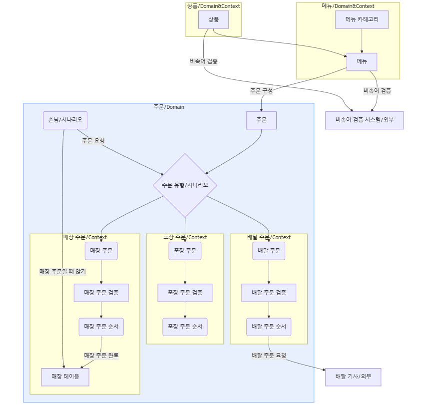

# 키친포스

## 퀵 스타트

```sh
cd docker
docker compose -p kitchenpos up -d
```

## 요구 사항

- 가게에서 상품과 메뉴를 등록하고 이를 주문하는 키친 포스 시스템을 구현합니다.

1. 상품

   1) 상품을 등록할 수 있다.
       - 상품가격은 0원 이상이어야 한다.
       - 상품명은 외부 검증을 통해 욕설이나 외설성이 있으면 안된다.
       - 상품명은 1글자 이상이어야 한다.
   2) 상품의 가격은 변경이 가능하다.
       - 상품가격은 0원 이상이어야 한다.
       - 상품은 주인이 등록한 상품만 수정 가능하다.
       - 메뉴에 있는 상품들의 가격의 총합이 메뉴의 전체 가격보다 낮으면 메뉴를 노출하지 않는다.
       - 메뉴에 있는 상품 A의 가격이 5000원, 상품 B의 가격이 6000원이라면 메뉴의 전체 가격은 11000원 보다 초과하면 더 이상 메뉴를 노출하지 않는다.
   3) 모든 상품을 조회할 수 있다.
       - 등록된 메뉴가 하나도 없다면 조회했을 때 아무 것도 뜨지 않는다.

2. 메뉴 모음

   1) 메뉴 모음을 등록할 수 있다.
       - 메뉴 모음의 이름은 1글자 이상이어야 한다.
   2) 모든 메뉴 모음을 조회할 수 있다.
       - 등록된 메뉴 모음이 하나도 없다면 조회했을 때 아무 것도 뜨지 않는다.

3. 메뉴

   1) 메뉴를 등록할 수 있다.
       - 메뉴의 가격은 0원 이상이어야 한다.
       - 메뉴 모음은 하나 이상의 메뉴로 구성되어야 한다.
       - 메뉴는 하나 이상의 상품으로 구성되어 있다.
       - 메뉴에 등록된 모든 상품은 이미 등록이 된 상품이어야 한다.
       - 메뉴를 구성하는 상품과 수량은 등록할 수 있다.
       - 메뉴의 전체 가격이 메뉴의 상품들의 전체 가격보다 크면 안된다.
       - 메뉴에 있는 상품 A의 가격이 5000원, 상품 B의 가격이 6000원이라면 메뉴의 전체 가격은 11000원 보다 초과하면 안된다.
           - 메뉴명은 1글자 이상이어야 한다.
   2) 메뉴의 가격은 변경이 가능하다.
       - 메뉴의 가격은 0원 이상이어야 한다.
       - 주인이 등록한 메뉴의 가격만 수정이 가능하다.
       - 메뉴에 등록된 상품들의 전체가격은 변경된 메뉴의 가격보다 크면 안된다.
       - 메뉴에 있는 상품 A의 가격이 5000원, 상품 B의 가격이 6000원이라면 메뉴의 전체 가격을 11000보다 적게 하면 안된다.
   3) 메뉴를 노출할 수 있다.
       - 주인이 등록한 메뉴만 노출할 수 있다.
       - 메뉴 상품들의 가격 합보다 메뉴 가격이 크면 메뉴를 노출할 수 없다.
       - 메뉴에 있는 상품 A의 가격이 5000원, 상품 B의 가격이 6000원이라면 메뉴의 전체 가격이 11000보다 적으면 메뉴를 노출할 수 없다.
   4) 메뉴를 노출하지 않을 수 있다.
       - 주인이 등록한 메뉴만 노출하지 않을 수 있다.
   5) 모든 메뉴를 조회할 수 있다.
       - 등록된 메뉴가 하나도 없다면 조회했을 때 아무 것도 뜨지 않는다.

4. 주문

   1) 매장 주문일 때
       1. 주문을 등록할 수 있다.

          - 주문 유형은 배달, 테이크아웃, 매장으로 세가지가 존재한다.
          - 주문에는 구체적인 주문 항목들이 존재해야 한다.
          - 주문 항목들에 있는 메뉴는 등록된 메뉴여야 한다.
          - 메뉴의 전체 가격은 주문 항목들의 가격의 합과 같아야 한다.
              - 1000원 짜리 상품 A를 2개, 2000원 짜리 상품 B로 구성된 메뉴를 주문했다면 가격은 4000원이어야 한다.
          - 주문이 들어오면 주문은 대기상태이다.
          - 주문 시간은 주문이 들어온 현재시간으로 한다.
          - 매장에 사용 가능한 매장 테이블이 존재해야 한다.
       2. 주문이 들어오면 주문을 수락할 수 있다.
          - 주문이 들어와야 주문을 수락할 수 있다.
          - 대기 상태인 주문만 수락이 가능하다.
       3. 주문을 들어왔다면 메뉴를 준비한다.
          - 주문이 들어와야 메뉴 준비가 가능하다.
          - 주문이 수락됐다면 메뉴 준비 중으로 주문 상태가 변경된다.
       4. 메뉴 준비가 끝나면 주문을 완료할 수 있다.
          - 주문을 완료하고 매장 테이블이 사용 중이라면 테이블을 청소하고(사용 인원 초기화) 테이블을 사용 가능하도록 등록한다.
       5. 모든 주문을 조회할 수 있다.
          - 등록된 주문이 하나도 없다면 조회했을 때 아무 것도 뜨지 않는다.
   2) 테이크 아웃 주문일 때
       1. 주문을 등록할 수 있다.

          - 주문 유형은 배달, 테이크아웃, 매장으로 세가지가 존재한다.
          - 주문에는 구체적인 주문 항목들이 존재해야 한다.
          - 주문 항목들에 있는 메뉴는 등록된 메뉴여야 한다.
          - 메뉴의 전체 가격은 주문 항목들의 가격의 합과 같아야 한다.
              - 1000원 짜리 상품 A를 2개, 2000원 짜리 상품 B로 구성된 메뉴를 주문했다면 가격은 4000원이어야 한다.
          - 주문이 들어오면 주문은 대기상태이다.
          - 주문 항목이 없으면 안된다.
       2. 주문이 들어오면 주문을 수락할 수 있다.
          - 주문이 들어와야 주문을 수락할 수 있다.
            - 대기 상태인 주문만 수락이 가능하다.
       3. 주문을 들어왔다면 메뉴를 준비한다.
          - 주문이 들어와야 메뉴 준비가 가능하다.
          - 주문이 수락됐다면 메뉴 준비 중으로 주문 상태가 변경된다.
       4. 메뉴 준비가 끝나면 주문을 완료할 수 있다.
          - 메뉴 준비가 끝났을 때 주문을 완료한다.
       5. 모든 주문을 조회할 수 있다.
          - 등록된 주문이 하나도 없다면 조회했을 때 아무 것도 뜨지 않는다.
   3) 배달 주문일 때
       1. 주문을 등록할 수 있다.

          - 주문 유형은 배달, 테이크아웃, 매장으로 세가지가 존재한다.
          - 주문에는 구체적인 주문 항목들이 존재해야 한다.
          - 주문 항목들에 있는 메뉴는 등록된 메뉴여야 한다.
          - 메뉴의 전체 가격은 주문 항목들의 가격의 합과 같아야 한다.
              - 1000원 짜리 상품 A를 2개, 2000원 짜리 상품 B로 구성된 메뉴를 주문했다면 가격은 4000원이어야 한다.
          - 주문이 들어오면 주문은 대기상태이다.
          - 주문 항목이 없으면 안된다.
          - 배달 주소가 없으면 배달을 할 수 없다.
       2. 주문이 들어오면 주문을 수락할 수 있다.
          - 주문이 들어와야 주문을 수락할 수 있다.
          - 대기 상태인 주문만 수락이 가능하다.
          - 배달 기사에게 배달을 요청하려면 배달 주소와 주문 항목들의 총 가격 등의 주문 정보가 필요하다.
          - 배달 요청에 성공하면 주문 상태는 수락으로 변경된다.
       3. 주문을 들어왔다면 메뉴를 준비한다.
          - 주문이 들어와야 메뉴 준비가 가능하다.
          - 주문이 수락됐다면 메뉴 준비 중으로 주문 상태가 변경된다.
       4. 메뉴 준비가 끝나면 배달을 시작한다.
          - 메뉴 준비가 끝나면 배달 중으로 주문 상태가 변경된다.
       5. 배달 기사가 주문한 주소로 도착하면 배달이 완료된다.
          - 배달 중에 배달이 완료됐다면 배달 완료됨으로 주문 상태가 변경된다.
       6. 배달이 완료 됐다면 주문을 완료할 수 있다.
          - 배달이 완료되면 주문을 완료한다.
       7. 모든 주문을 조회할 수 있다.
          - 등록된 주문이 하나도 없다면 조회했을 때 아무 것도 뜨지 않는다.

   5. 매장 테이블

   1) 매장 테이블은 등록이 가능하다.
       - 매장 테이블의 이름은 1글자 이상이어야 한다.
       - 매장 테이블의 사용 인원은 0명으로 등록한다.
       - 매장 테이블은 등록할 때 사용이 가능한 상태이다.
   2) 매장 테이블은 매장 방문 고객이 착석이 가능하다.
       - 착석하고자 하는 매장 테이블은 등록이 된 테이블이어야 한다.
       - 테이블에 고객이 착석한다면 사용 중으로 상태가 변경된다.
   3) 매장 테이블은 청소가 가능하다.
       - 청소하고자 하는 매장 테이블은 등록이 된 테이블이어야 한다.
       - 고객이 주문을 완료했다면 매장 테이블을 청소하고(인원 초기화) 테이블 사용가능 상태로 변경한다.
   4) 매장 테이블을 사용하는 인원은 늘어나거나 줄어들 수 있다.
       - 매장 테이블을 이용하는 고객은 최소 1명 이상이어야 한다.
       - 매장 테이블은 등록이 된 테이블이어야 한다.
       - 이미 고객이 사용 중인 테이블은 고객이 늘어나거나 줄어들면 테이블의 사용 인원을 변경할 수 있다.
   5) 모든 매장 테이블은 조회할 수 있다.
       - 등록된 매장 테이블이 하나도 없다면 조회했을 때 아무 것도 뜨지 않는다.

## 용어 사전

### 상품 (Product)

| 한글명 | 영문명     | 설명                     |
|-----|---------|------------------------|
| 상품  | product | `상품`은 `메뉴`를 구성하는 단위이다. |

### 메뉴 상품 (Menu Product)

| 한글명   | 영문명          | 설명                               | 예시                                                                      |
|-------|--------------|----------------------------------|-------------------------------------------------------------------------|
| 메뉴 상품 | menu product | `메뉴`를 구성하는 1개 이상의 단일 `상품`의 그룹이다. | `메뉴` : 햄버거 세트 / `상품` : 햄버거, 콜라, 감자튀김 / `메뉴 상품` : 햄버거 1개, 감자튀김 1개, 콜라 1잔 |

### 메뉴 카테고리 (Menu Group)

| 한글명     | 영문명        | 설명          |
|---------|------------|-------------|
| 메뉴 카테고리 | menu group | 메뉴의 카테고리이다. |

### 메뉴 (Menu)

| 한글명   | 영문명             | 설명                                                  |
|-------|-----------------|-----------------------------------------------------|
| 메뉴    | menu            | `주문`을 구성하는 최소한의 단위이다.                               |
| 메뉴 게시 | menu display    | `메뉴`를 `주문`할 수 있는지에 대한 여부이다.                         |
| 마진    | margin          | `메뉴`가격이 `메뉴`를 이루는 `상품`들의 가격의 총합보다 높은 것을 말한다.        |
| 메뉴 검증 | menu validation | `메뉴`의 `상품`들과 `메뉴 카테고리`의 구성이 동일하게 존재하는지 확인하는 것을 말한다. |

### 매장 테이블 (Order Table)

| 한글명    | 영문명         | 설명                              |
|--------|-------------|---------------------------------|
| 매장 테이블 | order table | `매장 테이블`은 `매장 주문`을 할 수 있는 장소이다. |
| 앉기     | sit         | `매장 테이블`을 `손님`이 점유한다.           |
| 청소하기   | clear       | `매장 주문 완료`시에 `매장 테이블`을 청소한다.    |

### 주문 (Order)

| 한글명   | 영문명            | 설명                                                                  |
|-------|----------------|---------------------------------------------------------------------|
| 주문    | order          | `주문`은 `게시`된 `메뉴`를 구매하는 것이다.                                         |
| 주문 메뉴 | orderLineItems | `주문`을 통해 구매한 `메뉴`들을 의미한다.                                           |
| 주문 유형 | order type     | `배달 주문`, `포장 주문`, `매장 주문`로 구성된 `주문`의 유형이다.                          |
| 주문 상태 | order status   | 현재 확인 가능한 `주문`의 상태이다.(주문 대기 중, 주문 접수 완료, 서빙 완료, 배달 중, 배달 완료, 주문 완료) |
| 손님    | guest          | `주문`을 목적으로 하는 사람이다.                                                 |

### 배달 주문 (Delivery)

| 한글명         | 영문명                       | 설명                                                                                    |
|-------------|---------------------------|---------------------------------------------------------------------------------------|
| 배달 주문       | delivery order            | `주문 유형`이 `배달 주문`인 `주문`을 말한다.                                                          |
| 배달 주문 검증    | delivery order validation | `배달 주문`시에 `배달 주소`가 있는지 검증한다.                                                          |
| 배달 주소       | delivery address          | `배달 주문`의 목적지인 장소를 말한다.                                                                |
| 배달 주문 순서    | delivery flow             | `배달 주문`의 과정의 흐름을 말한다.(배달 주문 대기 - 배달 주문 접수 완료 - 배달 주문 서빙 완료 - 배달 중 - 배달 완료 - 배달 주문 완료) |
| 배달 주문 대기    | delivery order waiting    | `손님`이 `배달 주문`을 한 상태이다.                                                                |
| 배달 주문 접수 완료 | delivery order accepted   | `배달 기사`가 `배달 주문`을 수락한 상태이다.                                                           |
| 배달 주문 서빙 완료 | delivery order served     | 조리가 완료된 음식을 `배달 기사`에게 제공한 상태이다.                                                       |
| 배달 중        | delivery order delivering | `배달 기사`가 배달을 진행하고 있는 상태이다.                                                            |
| 배달 완료       | delivery order delivered  | `배달 기사`가 `손님`의 배달을 완료한 상태이다.                                                          |
| 배달 주문 완료    | delivery order completed  | `배달 순서`가 종료된 상태이다.                                                                    |

### 포장 주문 (Takeout)

| 한글명         | 영문명                      | 설명                                                                     |
|-------------|--------------------------|------------------------------------------------------------------------|
| 포장 주문       | takeout order            | `주문 유형`이 `포장 주문`인 `주문`을 말한다.                                           |
| 포장 주문 검증    | takeout order validation | `포장 주문`시에 `주문 메뉴`의 수량이 있는지 검증한다.                                       |
| 포장 주문 순서    | takeout flow             | `포장 주문`의 과정의 흐름을 말한다.(포장 주문 대기 → 포장 주문 접수 완료 → 포장 주문 서빙 완료 → 포장 주문 완료) |
| 포장 주문 대기    | takeout order waiting    | `손님`이 `포장 주문`을 한 상태이다.                                                 |
| 포장 주문 접수 완료 | takeout order accepted   | `포장 주문`을 수락한 상태이다.                                                     |
| 포장 주문 서빙 완료 | takeout order served     | `손님`에게 조리가 완료된 음식을 제공한 상태이다.                                           |
| 포장 주문 완료    | takeout order completed  | `포장 순서`가 종료된 상태이다.                                                     |

### 매장 주문 (Eat-in)

| 한글명         | 영문명                     | 설명                                                                     |
|-------------|-------------------------|------------------------------------------------------------------------|
| 매장 주문       | eat-in order            | `주문 유형`이 `매장 주문`인 `주문`을 말한다.                                           |
| 매장 주문 검증    | eat-in order validation | `매장 주문`시에 사용 가능한 `매장 테이블`가 있는지 검증한다.                                   |
| 매장 주문 순서    | eat-in flow             | `매장 주문`의 과정의 흐름을 말한다.(매장 주문 대기 - 매장 주문 접수 완료 - 매장 주문 서빙 완료 - 매장 주문 완료) |
| 매장 주문 대기    | eat-in order waiting    | `매장 테이블`에 `앉은 손님`이 `매장 주문`을 한 상태이다.                                    |
| 매장 주문 접수 완료 | eat-in order accepted   | `매장 주문`을 수락한 상태이다.                                                     |
| 매장 주문 서빙 완료 | eat-in order served     | `손님`에게 조리가 완료된 음식을 제공한 상태이다.                                           |
| 매장 주문 완료    | eat-in order completed  | `매장 순서`가 종료된 상태로 `매장 테이블`을 `청소`한다.                                     |

### 주문 내역 (Order Item Line)

| 한글명   | 영문명             | 설명                              |
|-------|-----------------|---------------------------------|
| 주문 내역 | order Item line | `주문 내역`은 단일`주문`한 `메뉴`에 대한 그룹이다. |

### 외부 시스템 (external System)

| 한글명        | 영문명                 | 설명                                     |
|------------|---------------------|----------------------------------------|
| 비속어        | purgomalum          | 욕설이나 외설적 단어 등 공식적인 명칭으로 사용할 수 없는 단어이다. |
| 비속어 검증 시스템 | purgomalumClient    | 단어가 `비속어`인지 검증한다.                      |
| 배달 기사      | kitchenridersClient | 배달 서비스를 제공하는 주체이다.                     |

## 모델링

#### 1. 상품
- `상품`은 이름과 가격을 가진다.

#### 2. 메뉴

- `메뉴`는 `메뉴`의 카테고리 유형을 정의하는 `메뉴 카테고리`를 가진다.
- `메뉴`는 여러 `상품`들을 가진다.
- `메뉴`와 `상품`은 `비속어 검증 시스템`을 통해 이름을 검증한다.

#### 3. 주문

- `주문`은 여러 `메뉴`들을 가진다.
- `주문`은 `주문`의 방식을 선택할 수 있는 `주문 유형`을 가진다.

#### 4. 배달 주문

- `배달 주문`은 `배달 주문`의 흐름을 확인할 수 있는 `배달 주문 순서`를 가진다.
- `배달 주문`은 `배달 주소`가 있는지 확인하는 `배달 주문 검증`을 가진다.
- `배달 주문`은 `배달 주문 순서`에 따라 꼭 이전 `주문 상태`를 만족한다.
- `배달 주문`은 `배달 기사`를 통해 배달을 진행한다.

#### 5. 포장 주문

- `포장 주문`은 `포장 주문`의 흐름을 확인할 수 있는 `포장 주문 순서`를 가진다.
- `포장 주문`은 `주문 메뉴`의 수량이 있는지 확인하는 `포장 주문 검증`을 가진다.
- `포장 주문`은 `포장 주문 순서`에 따라 꼭 이전 `주문 상태`를 만족한다.

#### 6. 매장 주문

- `매장 주문`은 `매장 주문`의 흐름을 확인할 수 있는 `매장 주문 순서`를 가진다.
- `매장 주문`은 사용 가능한 `매장 테이블`이 있는지 확인하는 `매장 주문 검증`을 갖는다.
- `매장 주문`은 `손님`이 `앉을 수` 있는 `매장 테이블`을 가진다.
- `매장 주문`은 `매장 주문 순서`에 따라 꼭 이전 `주문 상태`를 만족한다.

#### 7. 매장 테이블

- `매장 테이블`은 `매장 주문 완료` 후에 `손님`이 떠나면 `청소`를 진행한다.

#### 8. 외부 시스템

- `비속어 검증 시스템`은 단어가 `비속어`인지 검증한다.
- `배달 기사`는 `배달 주문`을 통해 `배달 주소`를 받아 배달을 진행한다.

#### 9. 손님(시나리오)

- `손님`은 `주문`을 요청한다.
- `손님`은 `매장 테이블`에 `앉는다`.


