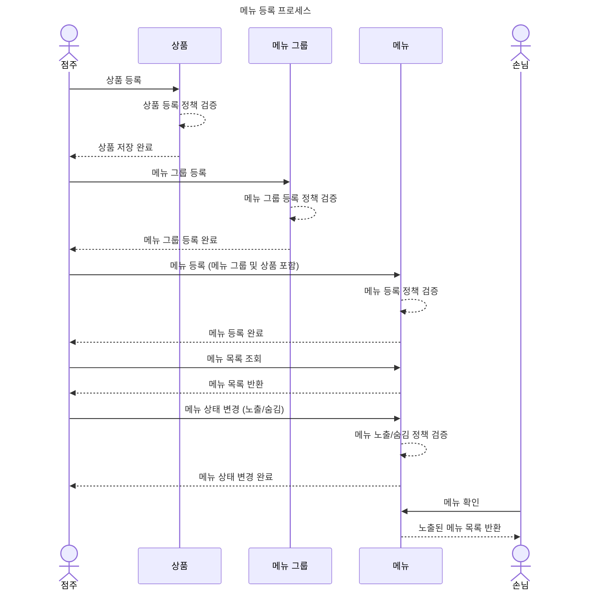
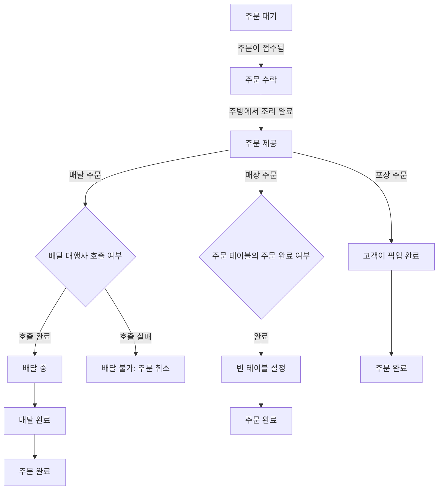
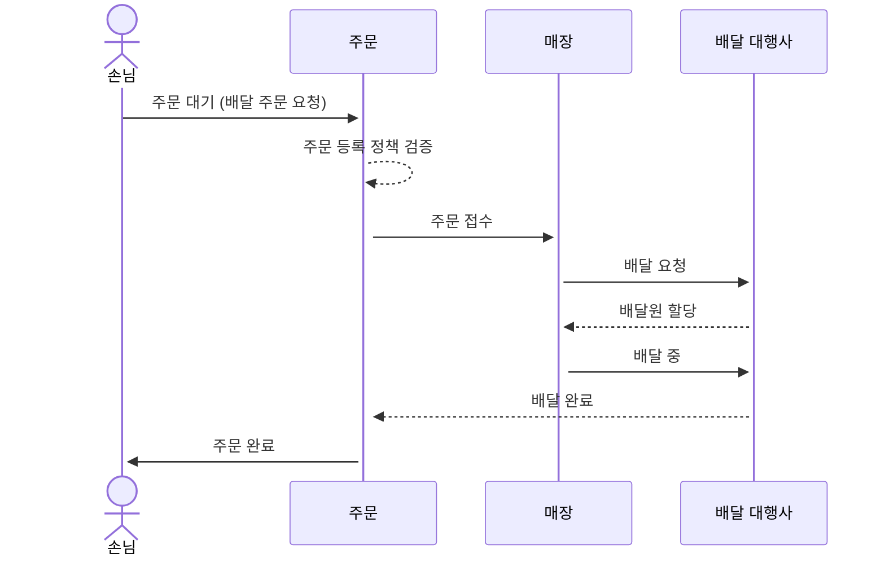
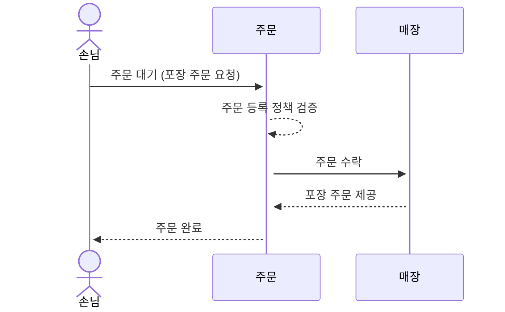
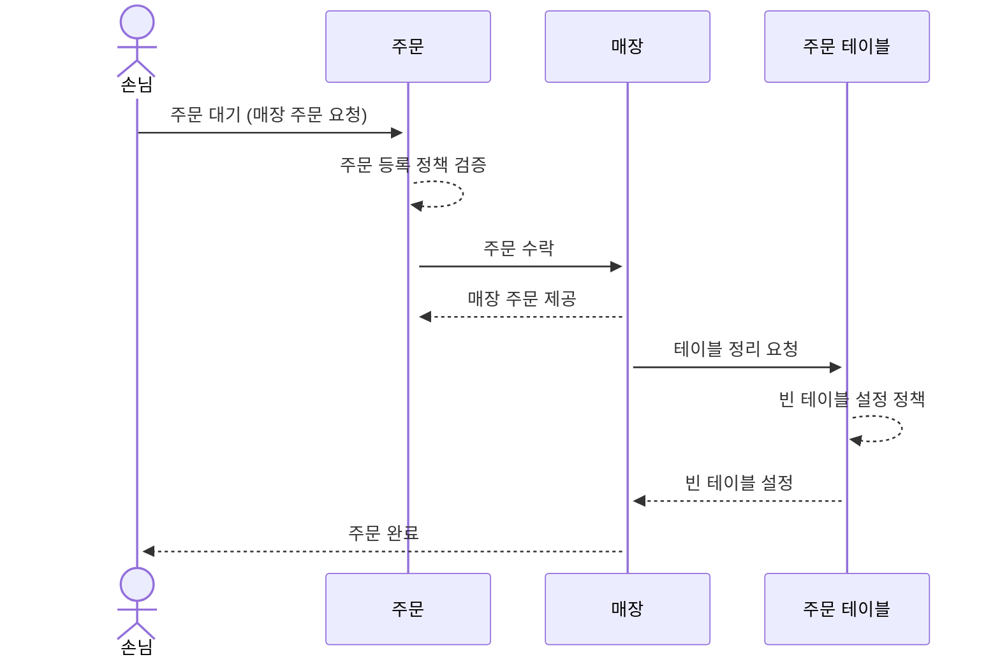

# 키친포스

## 퀵 스타트

****

```sh
cd docker
docker compose -p kitchenpos up -d
```
<details>
<summary>패키지구조</summary>

```bash
├── /global
│    ├── /event
│    ├── /exception
│    │   └── /validation
│    └── /infrastructure
│        └── /external
├── /menu
│    ├── /application
│    │    ├── /dto
│    │    └── /facade
│    ├── /domain
│    │    ├── /entity
│    │    ├── /event
│    │    ├── /exception
│    │    ├── /model
│    │    ├── /repository
│    │    └── /service
│    ├── /infrastructure
│    │    └── /persistence
│    └── /presentation
│         └── /controller
├── /product
│    ├── /application
│    │    ├── /dto
│    │    └── /facade
│    ├── /domain
│    │    ├── /entity
│    │    ├── /event
│    │    ├── /exception
│    │    ├── /model
│    │    ├── /repository
│    │    └── /service
│    ├── /infrastructure
│    │    └── /persistence
│    └── /presentation
│         └── /controller
├── /order
│    ├── /common
│    │    ├── /application
│    │    │    ├── /dto
│    │    │    └── /facade
│    │    ├── /domain
│    │    │    ├── /dto
│    │    │    ├── /entity
│    │    │    ├── /repository
│    │    │    ├── /service
│    │    ├── /infrastructure
│    │    │    ├── /persistence
│    │    │    └── /external
│    │    └── /presentation
│    │         └── /controller
│    ├── /delivery
│    │    ├── /domain
│    │    │    ├── /model
│    │    │    └── /service
│    ├── /takeout
│    │    ├── /domain
│    │    │    ├── /model
│    │    │    ├── /service
│    └── /eatin
│         └── /domain
│              ├── /entity
│              ├── /model
│              └── /service
```

</details>

<details>
<summary>요구사항</summary>

- 기존 레거시 키친포스를 리팩토링 한다.

****

### 1. 상품 (product)

1. 상품 조회
    - [x] 특정 조건 없이 상품의 모든 목록을 조회할 수 있다.
2. 상품 등록
    - [x] 상품명을 반드시 가지며 비속어를 포함하면 안된다.
    - [x] 상품가격은 0원 이상이어야 한다.
    - [x] 상품은 단건으로만 등록이 가능하다.
3. 상품 수정 (상품가격 수정)
    - [x] 상품가격이 0원 이상이어야 한다.
    - [x] 메뉴의 가격이 메뉴 구성 상품들의 총 금액보다 크면 해당 메뉴는 숨겨진다.

****

### 2. 메뉴 그룹 (menu group)

1. 메뉴 그룹 조회
    - [x] 특정 조건 없이 모든 목록을 조회할 수 있다.
2. 메뉴 그룹 등록
    - [x] 메뉴 그룹명을 반드시 가진다.

****

### 3. 메뉴 (menu)

- [x] 메뉴는 메뉴명, 메뉴가격, 노출여부, 메뉴 그룹의 정보를 반드시 가진다.

1. 메뉴 조회
    - [x] 특정 조건 없이 모든 목록을 조회할 수 있다.
2. 메뉴 등록
    - [x] 메뉴가격은 0원 이상이어야 한다.
    - [x] 메뉴 그룹에 속해 있어야 한다.
    - [x] 메뉴명도 상품명처럼 비속어를 포함하면 안된다.
    - [x] 등록 메뉴가격이 구성 상품의 총 금액보다 크지 않아야 한다.
    - [x] 메뉴 상품 정보를 반드시 가진다.
    - [x] 메뉴 상품 정보에 속한 상품의 수량은 1개 이상이어야 한다.
3. 메뉴 노출
    - [x] 메뉴가격이 구성 상품 총 금액보다 크지 않아야 한다.
4. 메뉴 숨김
    - [x] 등록 메뉴를 숨긴다.
5. 메뉴 가격 변경
    - [x] 변경가격이 0원 보다 작으면 안된다.
    - [x] 변경가격이 메뉴 구성 상품 총 금액보다 크지 않아야 한다.

****

### 4. 주문 (orders)

- [x] 주문상태, 주문유형, 주문시간을 반드시 가진다.

1. 주문 조회
    - [x] 특정 조건 없이 모든 목록을 조회할 수 있다.
2. 주문 등록
    - [x] 배달, 먹고가기, 포장(주문 유형)이 반드시 있어야 한다.
    - [x] 주문 아이템이 반드시 있어야 한다.
    - [x] 주문 아이템의 수량은 0개 이상이어야 한다.
    - [x] 주문 아이템의 메뉴는 반드시 있어야 한다.
    - [x] 배달, 포장 주문시 수량이 0원 이상이어야 한다.
    - [x] 메뉴가 노출된 상태여야 한다.
    - [x] 메뉴가격과 주문 아이템 가격이 다르면 안된다.
    - [x] 배달 주문시 배달 주소가 반드시 있어야 한다.
    - [x] 먹고가기(주문유형)의 경우 주문 테이블내역이 있어야 한다.
3. 주문 수락
    - [x] 현 주문상태가 **대기**이어야 한다.
    - [x] 배달 주문인 경우, 라이더에게 주문번호, 주문 아이템의 총 금액, 배달 주소를 전달해 배달 요청한다.
4. 서빙/준비 완료
    - [x] 현 주문상태가 **수락**이어야 한다.
5. 배달 시작
    - [x] 주문 유형이 **배달**이어야 한다.
    - [x] 현 주문상태가 **서빙/준비 완료**이어야 한다.
6. 배달 완료
    - [x] 현 주문상태가 **배달중**이어야 한다.
7. 주문 완료
    - [x] 배달(주문유형)인데 배달완료(주문상태)가 아니면 안된다.
    - [x] 포장, 먹고가기(주문유형)일 경우 서빙완료(주문상태)이어야 한다.
    - [x] 먹고가기(주문유형)일 경우, 해당 주문을 완료 처리 하고 해당 테이블에 다른 진행 중인 주문이 없다면 테이블을 비우고 인원 수를 0명으로 설정한다.

****

### 5. 주문 테이블 (order table)

- [x] 주문 테이블은 테이블번호, 인원 수, 사용여부 값을 반드시 가진다.

1. 주문 테이블 조회
    - [x] 특정 조건 없이 모든 목록을 조회할 수 있다.
2. 주문 테이블 등록
    - [x] 테이블명은 공란일 수 없다.
3. 테이블 착석
    - [x] 테이블 사용중 처리한다.
4. 테이블 정리
    - [x] 주문 테이블이 있으면 주문상태가 **완료**이어야 한다.
    - [x] 빈 테이블로 설정한다.
5. 테이블 인원 변경
    - [x] 테이블 사용중인 상태여야 한다.
    - [x] 테이블 인원 수는 0명 이상이어야 한다.

</details>

<details>
<summary>용어사전</summary>

**[1]**: 유효성 검사와 관련된 필수조건도 명시를 하는게 좋을까?
<br>
**[2]**: 행위(CRUD)에 대해서도 용어사전으로 정리를 하는 것이 좋을까?

### 상품 (product)

한글 명     | 영문 명                 | 설명                           
----------|----------------------|------------------------------
| 상품  | product       | `메뉴`를 구성할 수 있는 `판매할 수 있는 상품` |
| 상품 가격 | product price | `상품`의 판매 가격 (0원 이상) [1]      |
| 상품명 | product name  | `상품`의 이름 (비속어 포함 불가) [1]     |
| 상품 목록 | product list  | 등록된 `상품`들의 전체 목록             |
| 상품 등록  | create product       | 새로운 `상품`을 등록하는 기능 [2]        |
| 상품 가격 변경 | change product price | 기존 `상품`의 가격을 수정하는 기능 [2]     |
| 상품 목록 조회 | find product list      | 등록된 `상품` 목록을 조회하는 기능 [2]     |

### 메뉴그룹 (menu group)

| 한글명         | 영문명             | 설명                    |
|-------------|-----------------|-----------------------------|
| 메뉴 그룹       | menu group      | 특정 카테고리에 속하는 `메뉴`들의 `상위 집단` |
| 메뉴 그룹명     | menu group name | `메뉴 그룹`의 이름           |
| 메뉴 그룹 목록    | menu group list | 등록된 `메뉴 그룹`들의 전체 목록   |
| 메뉴 그룹 목록 조회 | find menu group list | 등록된 `메뉴 그룹` 목록을 조회하는 기능 [2] |
| 메뉴 그룹 등록  | create menu group    | 새로운 `메뉴 그룹`을 등록하는 기능 [2]    |

### 메뉴 (menu)

| 한글명   | 영문명               | 설명                       |
|-------|-------------------|--------------------------|
| 메뉴    | menu              | `한 개의 상품`이상으로 구성된 주문 가능한 항목 |
| 메뉴 상품 | menu proudct      | `메뉴`에 포함된 개별 상품          |
| 메뉴 가격 | menu price        | `메뉴`의 판매 가격 (0원 이상)      |
| 메뉴명   | menu name         | `메뉴`의 이름 (비속어 포함 불가) |
| 메뉴 목록 | menu list         | 등록된 `메뉴`들의 전체 목록         |
| 메뉴 등록    | create menu       | 새로운 `메뉴`를 등록하는 기능 [2]    |
| 메뉴 목록 조회 | find menu list    | 등록된 `메뉴` 목록을 조회하는 기능 [2] |
| 메뉴 가격 변경 | change menu price | 기존 `메뉴`의 가격을 수정하는 기능 [2] |
| 메뉴 노출 | display menu      | 고객이 `주문할 수 있는 전시된` 상태  |
| 메뉴 숨김 | hide menu         | 고객이 `주문할 수 없는 전시종료된` 상태  |

### 주문 테이블 (order table)

| 한글명          | 영문명                     | 설명                                    |
|--------------|-------------------------|---------------------------------------|
| 주문 테이블       | order table             | 매장의 `주문이 가능한 테이블`                     |
| 주문 테이블명      | order table name        | `주문 테이블`의 이름 (비워 둘 수 없음)              |
| 방문 손님 수      | number of guests        | `주문 테이블`에 착석한 손님의 인원 수 (0명 이상)        |
| 주문 테이블 목록    | order table list        | 등록된 `주문 테이블`들의 전체 목록 [2]              |
| 주문 테이블 등록    | create order table      | 새로운 `주문 테이블`을 등록하는 기능 [2]             |
| 빈 테이블        | empty table             | 매장의 테이블을 정리하고 `착석한 손님이 없는 테이블`        |
| 빈 테이블 해지     | sit empty table         | 빈 `테이블`을 해지하는 기능 (손님이 테이블에 앉은 상태) [2] |
| 빈 테이블 설정     | clear empty table       | 빈 `테이블`로 설정하는 기능 (손님이 테이블에 없는 상태) [2] |
| 방문 손님 수 변경   | change number of guests | `주문 테이`블의 방문한 손님 수를 수정하는 기능 [2]       |
| 주문 테이블 목록 조회 | find order table list   | 등록된 `주문 테이블` 목록을 조회하는 기능 [2]          |

### 주문 (orders)

| 한글명       | 영문명                  | 설명                                |
|-----------|----------------------|-----------------------------------|
| 주문        | order           | 하나 이상의 메뉴 목록                      |
| 주문 유형     | order type           | 고객이 주문한 `메뉴를 제공받는 유형` (배달/포장/먹고가기)|
| 주문 상태     | order status         | 주문한 `메뉴의 현재 상황`을 제공하기 위한 `상태` |
| 주문 목록     | order list           | 고객이 `주문`한 목록 |
| 주문 목록 조회  | find order list | 등록된 주문 목록을 조회하는 기능 [2] |
| 배달 주문     | delivery order       | `배달대행사(라이더)`에게 메뉴를 제공받기위한 `주문 유형` 중 하나 |
| 포장 주문     | takeout order        | `고객이 직접 메뉴를 수령`하기위한 `주문 유형` 중의 하나 |
| 매장 주문     | table order          | `먹고가기 (테이블 식사)`를 하기위한 `주문 유형` 중 하나 |
| 주문 항목     | order item           | 고객이 메뉴를 선택 후 `주문`한 내역             |
| 배달 대행사    | delivery agency      | 배달 대행 업체                          |
| 배달 대행사 호출 | call delivery agency | 배달 대행 업체의 라이더 호출                  |
| 배달 주소     | delivery address     | 라이더가 배달 해야될 고객의 `배달지 주소`            |


### 주문 유형 (order type)

| 한글명  | 영문명      | 설명                   |
|------|----------|----------------------|
| 배달   | DELIVERY | `배달(배달대행사 호출)`로 주문한 경우 |
| 포장   | TAKEOUT  | `포장`으로 주문할 경우          |
| 먹고가기 | EAT_IN   | `먹고가기(매장주문)` 주문할 경우    |

### 주문 상태 (order status)

| 한글명   | 영문명        | 설명                  |
|-------|------------|---------------------|
| 주문 대기 | WAITING    | 주문 요청상태 (주문 등록 후 대기상태) |
| 주문 수락 | ACCEPTED   | 주문 요청 후 수락상태        |
| 주문 제공 | SERVED     | 주문 수락 후 제공완료 상태     |
| 배달 중  | DELIVERING | 서빙/제공완료 후 배달 중 상태   |
| 배달 완료 | DELIVERED  | 배달중 이후 배달완료 상태      |
| 주문 완료 | COMPLETED  | 주문 완료 상태            |

</details>

<details>
<summary>모델링</summary>

### 상품 (product)
* `상품 등록 정책`
  * `상품 가격`은 0원 이상이어야 한다.
  * `상품명`은 `비속어`가 포함될 수 없다.

* `상품 가격 변경 정책`
  * `상품 가격`은 0원 이상이어야 한다.
  * 메뉴의 가격이 메뉴를 구성하는 `상품 가격의 촘 금액을 초과`하면 `메뉴 숨김 정책`이 적용된다.

### 메뉴 그룹 (menu group)
* `메뉴 그룹 등록 정책`
  * `메뉴 그룹 이름`은 반드시 있어야 한다.

### 메뉴 (menu)
* `메뉴 등록 정책`
  * `1개 이상의 상품`이 반드시 있어야 한다.
  * `상품 수량`은 `0개 이상`이어야 한다.
  * `메뉴 가격`은 `0원 이상`이어야 한다.
  * 메뉴를 구성하는 `상품 가격의 총 금액`은 `메뉴 가격 이상`이어야 한다.


* `메뉴 가격 변경 정책`
  * `메뉴 가격`은 `0원 이상`이어야 한다.
  * 메뉴를 구성하는 `상품 가격의 총 금액`은 `메뉴 가격 이상`이어야 한다.


* `메뉴 노출 정책`
  * 메뉴를 구성하는 `상품 가격의 총 금액`은 `메뉴 가격 이상`이어야 한다.


* `메뉴 숨김 정책`
  * 메뉴의 가격이 메뉴를 구성하는 `상품 가격의 촘 금액을 초과`해야 한다.

### 주문 (order)
* `주문 등록 정책 (공통)`
  * `메뉴가 등록`되어 있어야 한다.
  * `1개 이상의 메뉴`로 주문해야 한다.
  * `주문 유형(배달/포장/매장 주문)`이 있어야 한다.
  * `숨김 메뉴`는 주문할 수 없다.
  * `주문 메뉴 가격`은 `실제 메뉴 가격`과 `일치`해야 한다.


* `배달 주문 등록 정책`
  * `배달 주소`가 반드시 있어야 한다.
  * `주문 항목의 수량`이 `0개 이상`이어야 한다.


* `포장 주문 등록 정책`
  * `주문 항목의 수량`이 `0개 이상`이어야 한다.


* `매장 주문 등록 정책`
  * `주문 항목의 수량`이 `0개 미만`일 수 있다.
  * `빈 테이블`은 주문할 수 없다.

### 주문 테이블 (order table)
* `주문 테이블 등록 정책`
  * `주문 테이블명`은 반드시 있어야 한다.


* `빈 테이블 설정 정책`
  * 주문 테이블이 `주문 완료되지 않으면` 설정할 수 없다.


* `테이블 인원 변경 정책`
  * `손님 수`는 `0명 이상`이어야 한다.
  * `빈 테이블`은 변경할 수 없다.

</details>

<details>
<summary>모델링 다이어그램</summary>

### 메뉴 등록 프로세스

```mermaid
%% Sequence Diagram: 메뉴 등록 프로세스
sequenceDiagram
    title 메뉴 등록 프로세스
    actor 점주 as 점주
    participant 상품
    participant 메뉴 그룹
    participant 메뉴
    actor 손님 as 손님

    점주->>상품: 상품 등록
    상품-->>상품: 상품 등록 정책 검증 
    상품-->>점주: 상품 저장 완료

    점주->>메뉴 그룹: 메뉴 그룹 등록
    메뉴 그룹-->>메뉴 그룹: 메뉴 그룹 등록 정책 검증
    메뉴 그룹-->>점주: 메뉴 그룹 등록 완료

    점주->>메뉴: 메뉴 등록 (메뉴 그룹 및 상품 포함)
    메뉴-->>메뉴: 메뉴 등록 정책 검증
    메뉴-->>점주: 메뉴 등록 완료
    점주->>메뉴: 메뉴 목록 조회
    메뉴-->>점주: 메뉴 목록 반환

    점주->>메뉴: 메뉴 상태 변경 (노출/숨김)
    메뉴-->>메뉴: 메뉴 노출/숨김 정책 검증
    메뉴-->>점주: 메뉴 상태 변경 완료

    손님->>메뉴: 메뉴 확인
    메뉴-->>손님: 노출된 메뉴 목록 반환
```
---

### 주문 프로세스

```mermaid
%% Flowchart: 주문 프로세스
graph TD
  %% 주문 공통 단계
  A[주문 대기] -->|주문이 접수됨| B[주문 수락]
  B -->|주방에서 조리 완료| C[주문 제공]

  %% 주문 제공 이후 분기 처리
  C -->|배달 주문| D1{배달 대행사 호출 여부}
  D1 -->|호출 완료| E1[배달 중] --> F1[배달 완료] --> G1[주문 완료]
  D1 -->|호출 실패| X1[배달 불가: 주문 취소]

  C -->|매장 주문| D2{주문 테이블의 주문 완료 여부}
  D2 -->|완료| Y2[빈 테이블 설정] --> E2[주문 완료]

  C -->|포장 주문| E3[고객이 픽업 완료] --> F3[주문 완료]
```

---

### 주문 유형별 주문 프로세스
#### 배달 주문

```mermaid
%% Sequence Diagram: 배달 주문 프로세스
sequenceDiagram
    actor 손님
    participant 주문
    participant 매장
    participant 배달 대행사

    손님->>+주문: 주문 대기 (배달 주문 요청)
    주문-->>+주문: 주문 등록 정책 검증
    주문->>+매장: 주문 접수
    매장->>+배달 대행사: 배달 요청
    배달 대행사-->>+매장: 배달원 할당
    매장->>+배달 대행사: 배달 중
    배달 대행사-->>+주문: 배달 완료
    주문->>+손님: 주문 완료
```

#### 포장 주문

```mermaid
%% Sequence Diagram: 포장 주문 프로세스
sequenceDiagram
    actor 손님
    participant 주문
    participant 매장

    손님->>+주문: 주문 대기 (포장 주문 요청)
    주문-->>+주문: 주문 등록 정책 검증
    주문->>+매장: 주문 수락
    매장-->>+주문: 포장 주문 제공
    주문-->>+손님: 주문 완료
```

#### 매장 주문


```mermaid
%% Sequence Diagram: 매장 주문 프로세스
sequenceDiagram
    actor 손님
    participant 주문
    participant 매장

    손님->>+주문: 주문 대기 (매장 주문 요청)
    주문-->>+주문: 주문 등록 정책 검증
    주문->>+매장: 주문 수락
    매장-->>+주문: 매장 주문 제공
    매장->>+주문 테이블: 테이블 정리 요청
    주문 테이블-->>+주문 테이블: 빈 테이블 설정 정책
    주문 테이블-->>+매장: 빈 테이블 설정
    매장-->>+손님: 주문 완료
```
</details>
