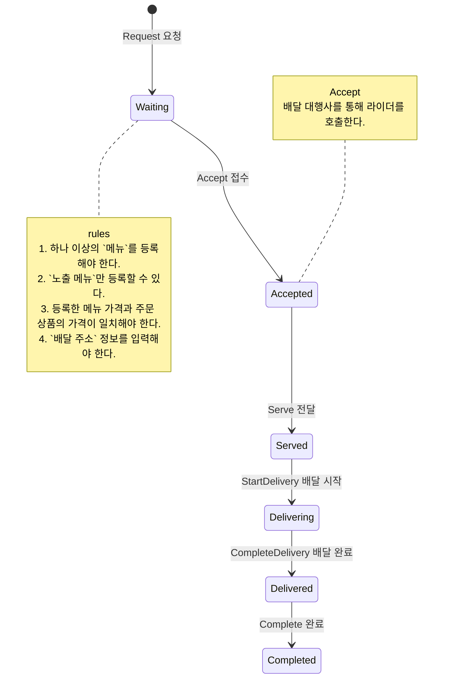
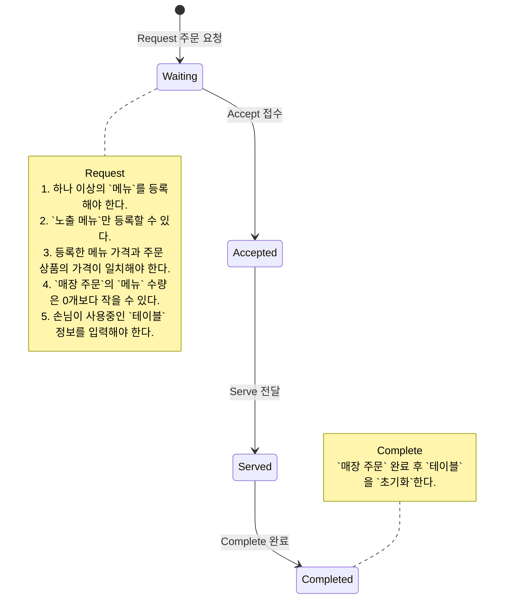
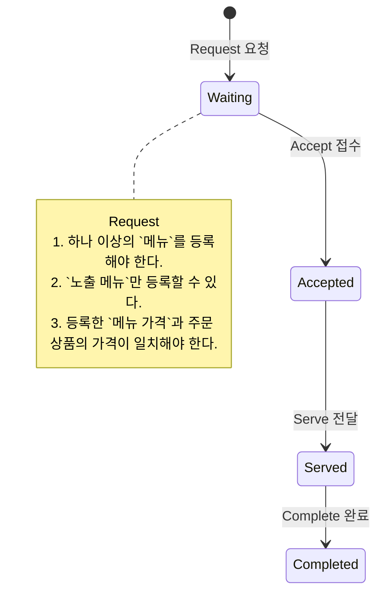
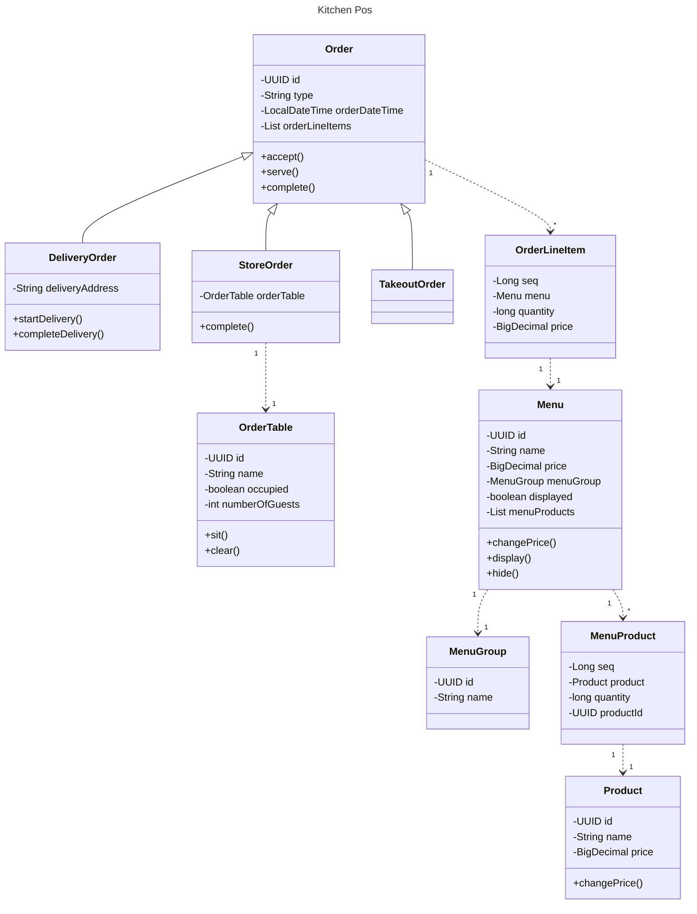

# 키친포스

## 퀵 스타트

```sh
cd docker
docker compose -p kitchenpos up -d
```

## 요구 사항

### 상품

- 상품을 등록할 수 있다.
- 상품의 가격이 올바르지 않으면 등록할 수 없다.
    - 상품의 가격은 0원 이상이어야 한다.
- 상품의 이름이 올바르지 않으면 등록할 수 없다.
    - 상품의 이름에는 비속어가 포함될 수 없다.
- 상품의 가격을 변경할 수 있다.
- 상품의 가격이 올바르지 않으면 변경할 수 없다.
    - 상품의 가격은 0원 이상이어야 한다.
- 상품의 가격이 변경될 때 메뉴의 가격이 메뉴에 속한 상품 금액의 합보다 크면 메뉴가 숨겨진다.
- 상품의 목록을 조회할 수 있다.

### 메뉴 그룹

- 메뉴 그룹을 등록할 수 있다.
- 메뉴 그룹의 이름이 올바르지 않으면 등록할 수 없다.
    - 메뉴 그룹의 이름은 비워 둘 수 없다.
- 메뉴 그룹의 목록을 조회할 수 있다.

### 메뉴

- 1 개 이상의 등록된 상품으로 메뉴를 등록할 수 있다.
- 상품이 없으면 등록할 수 없다.
- 메뉴에 속한 상품의 수량은 0 이상이어야 한다.
- 메뉴의 가격이 올바르지 않으면 등록할 수 없다.
    - 메뉴의 가격은 0원 이상이어야 한다.
- 메뉴에 속한 상품 금액의 합은 메뉴의 가격보다 크거나 같아야 한다.
- 메뉴는 특정 메뉴 그룹에 속해야 한다.
- 메뉴의 이름이 올바르지 않으면 등록할 수 없다.
    - 메뉴의 이름에는 비속어가 포함될 수 없다.
- 메뉴의 가격을 변경할 수 있다.
- 메뉴의 가격이 올바르지 않으면 변경할 수 없다.
    - 메뉴의 가격은 0원 이상이어야 한다.
- 메뉴에 속한 상품 금액의 합은 메뉴의 가격보다 크거나 같아야 한다.
- 메뉴를 노출할 수 있다.
- 메뉴의 가격이 메뉴에 속한 상품 금액의 합보다 높을 경우 메뉴를 노출할 수 없다.
- 메뉴를 숨길 수 있다.
- 메뉴의 목록을 조회할 수 있다.

### 주문 테이블

- 주문 테이블을 등록할 수 있다.
- 주문 테이블의 이름이 올바르지 않으면 등록할 수 없다.
    - 주문 테이블의 이름은 비워 둘 수 없다.
- 빈 테이블을 해지할 수 있다.
- 빈 테이블로 설정할 수 있다.
- 완료되지 않은 주문이 있는 주문 테이블은 빈 테이블로 설정할 수 없다.
- 방문한 손님 수를 변경할 수 있다.
- 방문한 손님 수가 올바르지 않으면 변경할 수 없다.
    - 방문한 손님 수는 0 이상이어야 한다.
- 빈 테이블은 방문한 손님 수를 변경할 수 없다.
- 주문 테이블의 목록을 조회할 수 있다.

### 주문

- 1개 이상의 등록된 메뉴로 배달 주문을 등록할 수 있다.
- 1개 이상의 등록된 메뉴로 포장 주문을 등록할 수 있다.
- 1개 이상의 등록된 메뉴로 매장 주문을 등록할 수 있다.
- 주문 유형이 올바르지 않으면 등록할 수 없다.
- 메뉴가 없으면 등록할 수 없다.
- 매장 주문은 주문 항목의 수량이 0 미만일 수 있다.
- 매장 주문을 제외한 주문의 경우 주문 항목의 수량은 0 이상이어야 한다.
- 배달 주소가 올바르지 않으면 배달 주문을 등록할 수 없다.
    - 배달 주소는 비워 둘 수 없다.
- 빈 테이블에는 매장 주문을 등록할 수 없다.
- 숨겨진 메뉴는 주문할 수 없다.
- 주문한 메뉴의 가격은 실제 메뉴 가격과 일치해야 한다.
- 주문을 접수한다.
- 접수 대기 중인 주문만 접수할 수 있다.
- 배달 주문을 접수되면 배달 대행사를 호출한다.
- 주문을 서빙한다.
- 접수된 주문만 서빙할 수 있다.
- 주문을 배달한다.
- 배달 주문만 배달할 수 있다.
- 서빙된 주문만 배달할 수 있다.
- 주문을 배달 완료한다.
- 배달 중인 주문만 배달 완료할 수 있다.
- 주문을 완료한다.
- 배달 주문의 경우 배달 완료된 주문만 완료할 수 있다.
- 포장 및 매장 주문의 경우 서빙된 주문만 완료할 수 있다.
- 주문 테이블의 모든 매장 주문이 완료되면 빈 테이블로 설정한다.
- 완료되지 않은 매장 주문이 있는 주문 테이블은 빈 테이블로 설정하지 않는다.
- 주문 목록을 조회할 수 있다.

## 용어 사전

### 공통
| 한글명 | 영문명       | 설명                               |
|-----|-----------|----------------------------------|
| 사장님 | Owner     | 매장에서 포스기를 사용하여 주문을 처리하는 사람       |
| 손님  | Guest     | 매장으로 주문을 넣는 사람                   |
| 비속어 | Profanity | 불쾌감을 주는 단어로 상품과 메뉴 이름에 사용될 수 없다. |

### 상품
| 한글명   | 영문명           | 설명                                              |
|-------|---------------|-------------------------------------------------|
| 상품    | Product       | 매장에서 조리하여 판매가능한 음식 ex) 후라이드 치킨                  |
| 상품 가격 | Product Price | 상품 1개의 가격. 가격은 0원 이상이어야 하며 변경할 수 있다. ex) 10000원 |
| 상품 이름 | Product Name  | 상품을 구분하기 위한 이름. 비속어는 들어갈 수 없다.                  |

### 메뉴 그룹
| 한글명      | 영문명            | 설명                             |
|----------|----------------|--------------------------------|
| 메뉴 그룹    | MenuGroup      | 메뉴를 분류하는 카테고리 ex) 추천, 세트메뉴, 음료 |
| 메뉴 그룹 이름 | MenuGroup Name | 메뉴 그룹 이름으로 빈 문자열은 들어갈 수 없다.    |

### 메뉴
| 한글명      | 영문명          | 설명                                                              |
|----------|--------------|-----------------------------------------------------------------|
| 메뉴       | Menu         | 손님에게 판매되는 단위. 하나 이상의 음식(상품)으로 구성되며 하나의 메뉴 그룹에 속한다. ex) 후라이드 1+1 |
| 메뉴 상품    | Menu Product | 메뉴를 구성하는 상품이고 1개 이상의 수량 정보를 갖는다. ex) 후라이드 2개                    |
| 메뉴 가격    | Menu Price   | 손님에게 판매되는 가격. 가격은 메뉴 상품 금액의 합보다 낮아야하며 변경할 수 있다. ex) 19000원      |
| 메뉴 이름    | Menu Name    | 손님에게 노출되는 이름. 비속어는 들어갈 수 없다.                                    |
| 메뉴 노출 상태 | Displayed    | 메뉴를 손님에게 노출시킬지를 결정하는 상태                                         |
| 노출 메뉴    | Display Menu | 손님에게 노출되는 메뉴                                                    |
| 숨김 메뉴    | Hide Menu    | 손님에게 숨겨지는 메뉴                                                    |

### 주문
| 한글명   | 영문명             | 설명                                                                                  |
|-------|-----------------|-------------------------------------------------------------------------------------|
| 주문    | Order           | 손님에게 주문되는 단위. 하나 이상의 메뉴로 구성된다.                                                      |
| 주문 메뉴 | Order Line Item | 주문을 구성하는 메뉴이고 1개 이상의 수량을 갖는다. ex) `후라이드 1+1 2개`                                     |
| 주문 유형 | Order Type      | 손님이 주문하는 유형. ex) [배달 주문](#배달-주문), [매장 주문](#매장-주문), [포장 주문](#포장-주문)                  |
| 배달 주문 | Delivery Order  | 손님이 주소로 메뉴 배달을 요청하는 주문                                                              |
| 매장 주문 | Store Order     | 손님이 매장 테이블로 메뉴 서빙을 요청하는 주문                                                          |
| 포장 주문 | Takeout Order   | 손님이 메뉴 포장을 요청하는 주문                                                                  |
| 주문 상태 | Order Status    | 주문의 진행 현황을 나타내는 상태. ex) Waiting, Accepted, Served, Delivering, Delivered, Completed |
| 주문 시간 | Order Date Time | 주문이 생성된 시간                                                                          |

#### 배달 주문
| 한글명    | 영문명              | 설명                                                  |
|--------|------------------|-----------------------------------------------------|
| 배달 주소  | Delivery Address | 배달 주문 손님에게 배달을 가야하는 목적지 주소                          |
| 라이더    | Rider            | 배달 주문된 메뉴들을 배달 주소에 전달해줄 사람                          |
| 배달 대행사 | Delivery Agency  | 라이더가 소속된 업체. 사장님은 배달 주문된 메뉴를 손님에게 전달하기 위해 요청할 수 있다. |
| 배달 요청  | Delivery Request | 주문 접수 후 배달 대행사 통해 라이더를 호출한다.                        |
| 대기중    | Waiting          | 배달 주문이 생성되고 접수를 기다리는 상태                             |
| 접수됨    | Accepted         | 배달 요청 후 배달 주문이 접수된 상태                               |
| 전달됨    | Served           | 음식을 라이더에게 전달한 상태                                    |
| 배달중    | Delivering       | 라이더가 음식을 손님에게 배달중인 상태                               |
| 배달됨    | Delivered        | 라이더가 손님에게 음식을 배달완료한 상태                              |
| 완료됨    | Completed        | 주문의 모든 과정이 완료된 상태                                   |
| 요청     | Request          | 배달 주문을 요청하는 행위.                                     |
| 접수     | Accept           | 배달 주문을 접수하는 행위.                                     |
| 전달     | Serve            | 배달 주문의 메뉴를 라이더에게 전달하는 행위.                           |
| 배달 시작  | StartDelivery    | 라이더가 전달된 메뉴를 배달 주소에 전달하는 행위.                        |
| 배달 완료  | CompleteDelivery | 라이더가 배달 주소에 배달을 완료하는 행위.                            |
| 완료     | Complete         | 배달 주문을 완료하는 행위.                                     |

#### 매장 주문
| 한글명 | 영문명       | 설명                                       |
|-----|-----------|------------------------------------------|
| 대기중 | Waiting   | 매장 주문이 생성되고 접수를 기다리는 상태                  |
| 접수됨 | Accepted  | 매장 주문이 접수된 상태                            |
| 전달됨 | Served    | 테이블에 음식이 서빙된 상태                          |
| 완료됨 | Completed | 주문의 모든 과정이 완료된 상태로 주문이 완료되면 테이블을 초기화 한다. |
| 요청  | Request   | 매장 주문을 요청하는 행위.                          |
| 접수  | Accept    | 매장 주문을 접수하는 행위.                          |
| 전달  | Serve     | 매장 주문의 메뉴를 손님에게 전달하는 행위.                 |
| 완료  | Complete  | 매장 주문을 완료하는 행위.                          |

#### 포장 주문
| 한글명 | 영문명       | 설명                       |
|-----|-----------|--------------------------|
| 대기중 | Waiting   | 포장 주문이 생성되고 접수를 기다리는 상태  |
| 접수됨 | Accepted  | 포장 주문이 접수된 상태            |
| 전달됨 | Served    | 손님에게 포장된 음식이 전달된 상태      |
| 완료됨 | Completed | 주문의 모든 과정이 완료된 상태        |
| 요청  | Request   | 포장 주문을 요청하는 행위.          |
| 접수  | Accept    | 포장 주문을 접수하는 행위.          |
| 전달  | Serve     | 포장 주문의 메뉴를 손님에게 전달하는 행위. |
| 완료  | Complete  | 포장 주문을 완료하는 행위.          |

### 테이블
| 한글명      | 영문명              | 설명                                                  |
|----------|------------------|-----------------------------------------------------|
| 테이블      | Table            | 매장 주문이 가능한 테이블                                      |
| 테이블 이름   | Table Name       | 테이블을 구분하기 위한 이름. 빈 문자열은 들어갈 수 없다.                   |
| 테이블 상태   | Table Status     | 테이블이 주문을 받을 수 있는지 나타내는 상태.                          |
| 테이블 사용중  | Occupied         | 손님이 테이블을 사용할 수 없는 상태.                               |
| 테이블 비어있음 | Unoccupied       | 손님이 테이블을 사용할 수 있는 상태.                               |
| 인원 수     | Number Of Guests | 테이블에 앉은 손님 수. 0명 이상이어야 하며 사용중인 테이블의 인원 수를 변경할 수 있다. |
| 테이블 세팅   | Sit              | 손님이 앉은 테이블을 표시하는 행위.                                |
| 테이블 초기화  | Clear            | 매장 주문이 완료된 테이블을 다른 손님이 앉을 수 있는 상태로 초기화하는 행위.        |


## 모델링

### 상품
#### 프로퍼티
- `상품(Product)`은 `상품 이름(Product Name)`과 `상품 가격(Product Price)`을 필수로 가진다.
- `상품 이름(Product Name)`에 `비속어(Profanity)`를 사용할 수 없다.
- `상품 가격(Product Price)`은 0원 이상이여야 한다.

#### 행위
- `사장님(Owner)`은 `상품(Product)`을 등록할 수 있다.
- `사장님(Owner)`은 `상품 가격(Product Price)`을 변경할 수 있다.
    - `상품 가격(Product Price)` 변경 시 `메뉴 상품(Menu Product)` 가격의 합보다 `메뉴 가격(Menu Product)`이 비싸면 메뉴가 `숨김 처리(Hide)`된다.

### 메뉴 그룹
#### 프로퍼티
- `메뉴 그룹(Menu Group)`은 `메뉴 그룹 이름(Menu Group Name)`을 필수로 가진다.
- `메뉴 그룹 이름(Menu Group Name)`은 빈 문자열이 될 수 없다.
#### 행위
- `사장님(Owner)`은 `메뉴 그룹(Menu Group)`을 등록할 수 있다.

### 메뉴
#### 프로퍼티
- `메뉴(Menu)`는 `메뉴 이름(Menu Name)`, `메뉴 가격(Menu Product)`, `메뉴 그룹(Menu Group)`, `메뉴 상품(Menu Product)`, `메뉴 노출 상태(Displayed)`을 필수로 가진다.
- `메뉴 이름(Menu Name)`에 `비속어(Profanity)`를 사용할 수 없다.
- `메뉴 가격(Menu Product)`은 0원 이상이어야 한다.
- `메뉴 상품(Menu Product)` 가격의 합보다 `메뉴 가격(Menu Product)`이 비쌀 수 없다.
- 하나의 `메뉴 그룹(Menu Group)`을 설정해야 한다.
- 한 가지 이상의 `메뉴 상품(Menu Product)`을 등록해야 한다.
- `메뉴 상품(Menu Product)`의 수량은 하나 이상이어야 한다.
- `메뉴 노출 상태(Displayed)`를 `노출(Display)` 혹은 `숨김(Hide)` 상태로 설정할 수 있다.

#### 행위
- `사장님(Owner)`은 `메뉴(Menu)`를 등록할 수 있다.
- `사장님(Owner)`은 `메뉴 가격(Menu Product)`을 수정할 수 있다.
    - `메뉴 상품(Menu Product)` 가격의 합보다 `메뉴 가격(Menu Product)`이 비쌀 수 없다.
- `사장님(Owner)`은 `메뉴 노출 상태(Displayed)를 수정할 수 있다.
    - `노출 메뉴(Display Menu)`로 변경할 수 있다.
        - `메뉴 상품(Menu Product)` 가격의 합보다 `메뉴 가격(Menu Product)`이 비싸면 `노출(Display)` 상태로 변경할 수 없다.
    - `숨김 메뉴(Hide Menu)`로 변경할 수 있다.

### 테이블
#### 프로퍼티
- `테이블(Table)`은 `테이블 이름(Table Name)`, `테이블 상태(Table Status)`, `인원 수`를 필수로 가진다.
- `테이블 이름(Table Name)`은 빈 문자열이 될 수 없다.
- `테이블 상태(Table Status)`는 `사용중(Occupied)`과 `비어있음(Unoccupied)`을 갖는다.
- `인원 수(Number Of Guests)`는 0명 이상이어야 한다.

#### 행위
- `사장님(Owner)`은 `테이블(Table)`을 등록할 수 있다.
- `사장님(Owner)`은 `테이블(Table)`을 `세팅(Sit)`할 수 있다.
    - `손님`이 이미 앉아있는 테이블은 `세팅(Sit)`할 수 없다.
- `사장님(Owner)`은 `테이블(Table)`을 `초기화(Clear)`할 수 있다.
    - `매장주문(EatIn Order)`이 `완료(Completed)`되지 않은 테이블은 `초기화(Clear)` 할 수 없다.
- `사장님(Owner)`은 `테이블(Table)`인원을 수정할 수 있다.
    - `인원 수(Number Of Guests)`는 0명 이상이어야 한다.
    - `사용중(Occupied)`인 `테이블(Table)`의 `인원 수(Number Of Guests)`만 변경할 수 있다.

### 주문
#### 프로퍼티
- `주문(Order)`은 `주문 유형(Order Type)`, `주문 상태(Order Status)`, `주문 시간(Order Date Time)`, `주문 메뉴(Order Line Item)`을 필수로 갖는다. 그리고 `주문 유형(Order Typ)`에 따라 `배달 주소(Delivery)`와 `테이블(Table)`을 가진다.
- `주문 유형(Order Type)`은 `배달 주문(Delivery Order)`, `매장 주문(Store Order)`, `포장 주문(TakeOut Order)`을 갖는다.
- `주문 상태(Order Status)`는 `Waiting`, `Accepted`, `Served`, `Delivering`, `Delivered`, `Completed`를 갖는다.
- 하나 이상의 `주문 메뉴(Order Line Item)`를 등록해야 한다.
    - `노출 메뉴(Display Menu)`만 등록할 수 있다.
- 등록한 메뉴 가격과 주문 상품의 가격이 일치해야 한다.
- `배달 주문(Delivery Order)`의 경우 `배달 주소(Delivery)`를 갖는다.
- `매장 주문(Store Order)`의 경우 `테이블(Table)`을 갖는다.

> `주문 유형(Order Type)`에 따라 진행되는 행위는 다르며 이는 아래에서 설명한다.

### 배달 주문
#### 행위
`사장님(Owner)`은 포스기로 `배달 주문(Delivery Order)`을 진행시킬 수 있다.
- `배달 주문(Delivery Order)`을 `요청(Request)`할 수 있다.
- 요청된 `배달 주문(Delivery Order)`을 `접수(Accept)`할 수 있다.
    - 이때 `배달 대행사(Delivery Agency)`를 통해 라이더를 호출한다.
- 승인된 `배달 주문(Delivery Order)`을 `전달(Serve)`할 수 있다.
- 서빙된 `배달 주문(Delivery Order)`을 `배달 시작(StartDelivery)`할 수 있다.
- 배달이 시작된 `배달 주문(Delivery Order)`을 `배달 완료(CompleteDelivery)`할 수 있다.
- 배달이 완료된 `배달 주문(Delivery Order)`을 `완료(Complete)`할 수 있다.



### 매장 주문
`사장님(Owner)`은 포스기로 `매장 주문(Store Order)`을 진행시킬 수 있다.
- `매장 주문(Store Order)`을 `요청(Request)`할 수 있다.
- 요청된 `매장 주문(Store Order)`을 `접수(Accept)`할 수 있다.
- 승인된 `매장 주문(Store Order)`을 `전달(Serve)`할 수 있다.
- 서빙된 `매장 주문(Store Order)`을 `완료(Complete)`할 수 있다.
    - 이때 `테이블(Table)`을 `초기화(Clear)`한다.



### 포장 주문
`사장님(Owner)`은 포스기로 `포장 주문(Takeout Order)`을 진행시킬 수 있다.
- `포장 주문(Takeout Order)`을 `요청(Request)`할 수 있다.
- 요청된 `포장 주문(Takeout Order)`을 `접수(Accept)`할 수 있다.
- 승인된 `포장 주문(Takeout Order)`을 `전달(Serve)`할 수 있다.
- 서빙된 `포장 주문(Takeout Order)`을 `완료(Complete)`할 수 있다.



## 클래스 다이어그램
