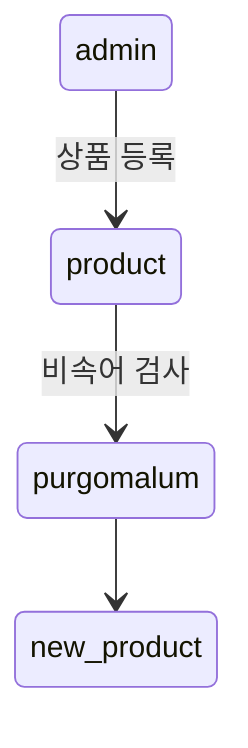
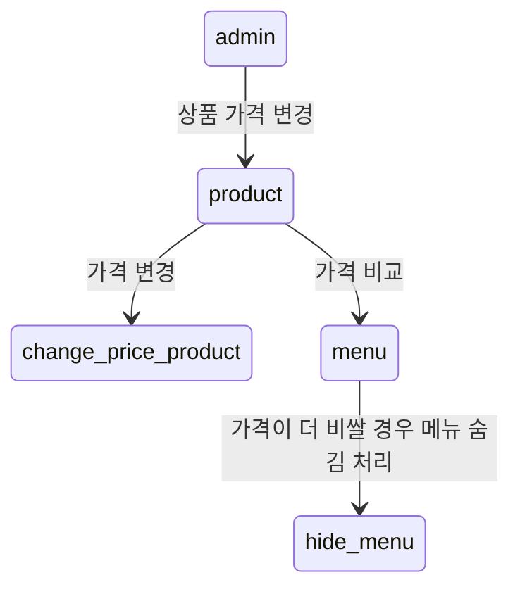
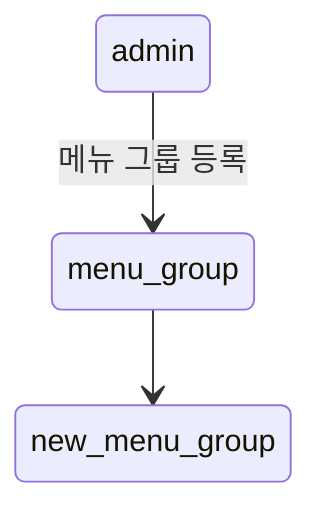
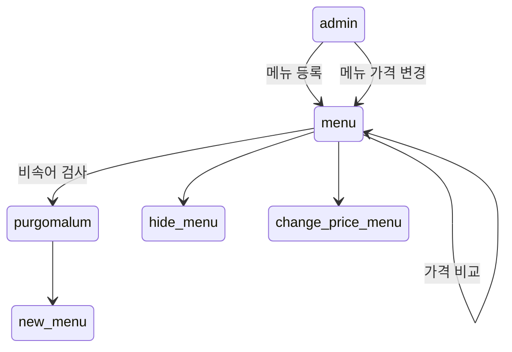
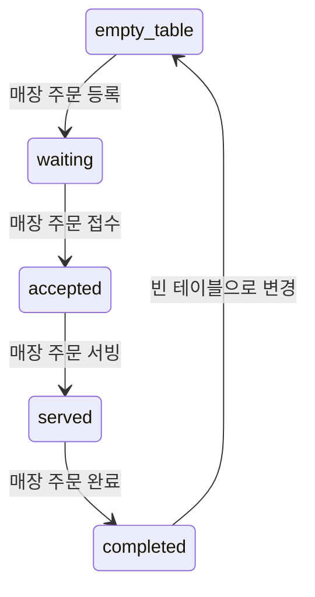
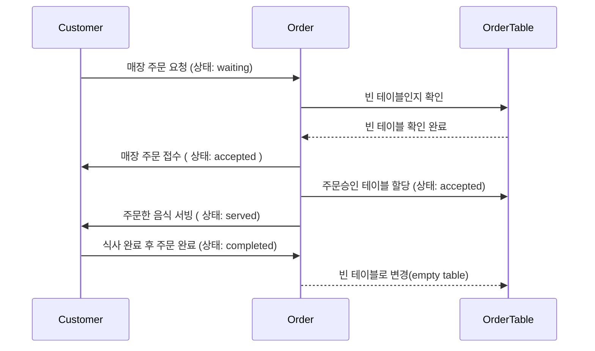
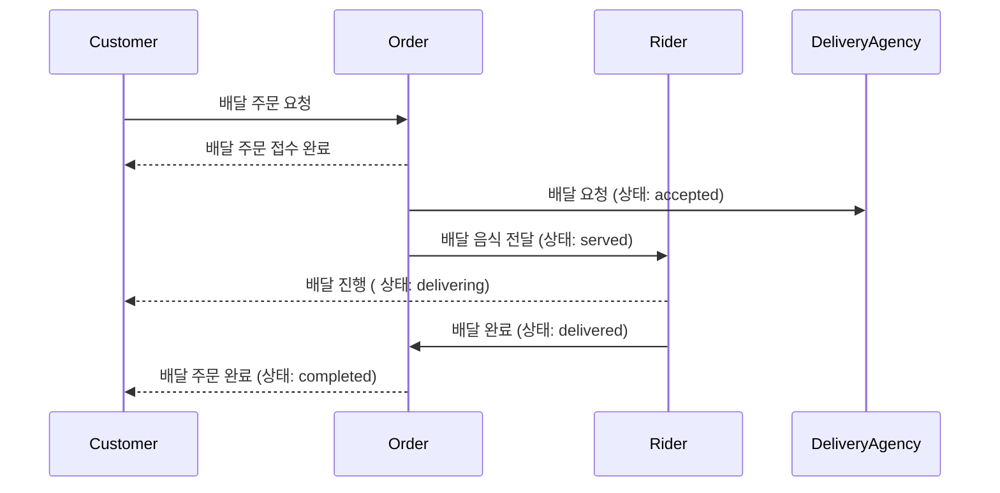
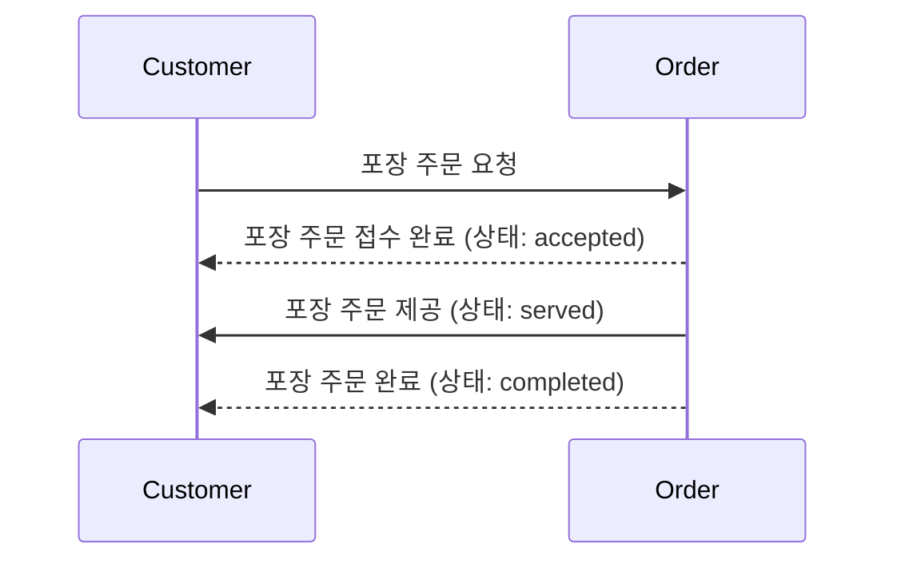

# 키친포스

## 퀵 스타트

```sh
cd docker
docker compose -p kitchenpos up -d
```

## 요구 사항

### 상품

- 상품을 등록할 수 있다.`
- 상품의 가격이 올바르지 않으면 등록할 수 없다.
    - 상품의 가격은 0원 이상이어야 한다.
- 상품의 이름이 올바르지 않으면 등록할 수 없다.
    - 상품의 이름에는 비속어가 포함될 수 없다.
- 상품의 가격을 변경할 수 있다.
- 상품의 가격이 올바르지 않으면 변경할 수 없다.
    - 상품의 가격은 0원 이상이어야 한다.
- 상품의 가격이 변경될 때 메뉴의 가격이 메뉴에 속한 상품 금액의 합보다 크면 메뉴가 숨겨진다.
- 상품의 목록을 조회할 수 있다.

### 메뉴 그룹

- 메뉴 그룹을 등록할 수 있다.
- 메뉴 그룹의 이름이 올바르지 않으면 등록할 수 없다.
    - 메뉴 그룹의 이름은 비워 둘 수 없다.
- 메뉴 그룹의 목록을 조회할 수 있다.

### 메뉴

- 1 개 이상의 등록된 상품으로 메뉴를 등록할 수 있다.
- 상품이 없으면 등록할 수 없다.
- 메뉴에 속한 상품의 수량은 0 이상이어야 한다.
- 메뉴의 가격이 올바르지 않으면 등록할 수 없다.
    - 메뉴의 가격은 0원 이상이어야 한다.
- 메뉴에 속한 상품 금액의 합은 메뉴의 가격보다 크거나 같아야 한다.
- 메뉴는 특정 메뉴 그룹에 속해야 한다.
- 메뉴의 이름이 올바르지 않으면 등록할 수 없다.
    - 메뉴의 이름에는 비속어가 포함될 수 없다.
- 메뉴의 가격을 변경할 수 있다.
- 메뉴의 가격이 올바르지 않으면 변경할 수 없다.
    - 메뉴의 가격은 0원 이상이어야 한다.
- 메뉴에 속한 상품 금액의 합은 메뉴의 가격보다 크거나 같아야 한다.
- 메뉴를 노출할 수 있다.
- 메뉴의 가격이 메뉴에 속한 상품 금액의 합보다 높을 경우 메뉴를 노출할 수 없다.
- 메뉴를 숨길 수 있다.
- 메뉴의 목록을 조회할 수 있다.

### 주문 테이블

- 주문 테이블을 등록할 수 있다.
- 주문 테이블의 이름이 올바르지 않으면 등록할 수 없다.
    - 주문 테이블의 이름은 비워 둘 수 없다.
- 빈 테이블을 해지할 수 있다.
- 빈 테이블로 설정할 수 있다.
- 완료되지 않은 주문이 있는 주문 테이블은 빈 테이블로 설정할 수 없다.
- 방문한 손님 수를 변경할 수 있다.
- 방문한 손님 수가 올바르지 않으면 변경할 수 없다.
    - 방문한 손님 수는 0 이상이어야 한다.
- 빈 테이블은 방문한 손님 수를 변경할 수 없다.
- 주문 테이블의 목록을 조회할 수 있다.

### 주문

- 1개 이상의 등록된 메뉴로 배달 주문을 등록할 수 있다.
- 1개 이상의 등록된 메뉴로 포장 주문을 등록할 수 있다.
- 1개 이상의 등록된 메뉴로 매장 주문을 등록할 수 있다.
- 주문 유형이 올바르지 않으면 등록할 수 없다.
- 메뉴가 없으면 등록할 수 없다.
- 매장 주문은 주문 항목의 수량이 0 미만일 수 있다.
- 매장 주문을 제외한 주문의 경우 주문 항목의 수량은 0 이상이어야 한다.
- 배달 주소가 올바르지 않으면 배달 주문을 등록할 수 없다.
    - 배달 주소는 비워 둘 수 없다.
- 빈 테이블에는 매장 주문을 등록할 수 없다.
- 숨겨진 메뉴는 주문할 수 없다.
- 주문한 메뉴의 가격은 실제 메뉴 가격과 일치해야 한다.
- 주문을 접수한다.
- 접수 대기 중인 주문만 접수할 수 있다.
- 배달 주문을 접수되면 배달 대행사를 호출한다.
- 주문을 서빙한다.
- 접수된 주문만 서빙할 수 있다.
- 주문을 배달한다.
- 배달 주문만 배달할 수 있다.
- 서빙된 주문만 배달할 수 있다.
- 주문을 배달 완료한다.
- 배달 중인 주문만 배달 완료할 수 있다.
- 주문을 완료한다.
- 배달 주문의 경우 배달 완료된 주문만 완료할 수 있다.
- 포장 및 매장 주문의 경우 서빙된 주문만 완료할 수 있다.
- 주문 테이블의 모든 매장 주문이 완료되면 빈 테이블로 설정한다.
- 완료되지 않은 매장 주문이 있는 주문 테이블은 빈 테이블로 설정하지 않는다.
- 주문 목록을 조회할 수 있다.

## 용어사전

### 공통

| 한글명 | 영문명      | 설명                    |
|-----|----------|-----------------------|
| 매장  | shop     | POS를 조작하고 치킨을 판매하는 가게 |
| 고객  | customer | 치킨을 구매하는 고객.          |
| 배달원 | rider    | 고객에게 치킨을 배달하는 사람.     |

### 상품

| 한글명 | 영문명     | 설명                  |
|-----|---------|---------------------|
| 상품  | product | 메뉴를 구성할 수 있는 최소 단위. |
| 가격  | price   | 0원 이상의 상품의 가격.      |
| 이름  | name    | 상품의 이름.             |

### 메뉴 그룹

| 한글명   | 영문명        | 설명                                         |
|-------|------------|--------------------------------------------|
| 메뉴 그룹 | menu group | 메뉴의 개념을  그룹화 한다.                           |
| 이름    | name       | 메뉴그룹의 개성을 나타내는 그룹의 이름.     ex.매운치킨들, 두마리메뉴 |

### 메뉴

| 한글명    | 영문명     | 설명                                     |
|--------|---------|----------------------------------------|
| 메뉴     | menu    | 고객에게 판매되는 단위.  하나 이상의 상품으로 구성된다.       |
| 이름     | name    | 메뉴의 이름                                 | 
| 가격     | price   | 0원 이상의 상품의 가격. 구성된 상품의 가격보다 크거나 같아야한다. |
| 공개 메뉴  | display | 고객이 주문가능한 공개된 메뉴                       |
| 비공개 메뉴 | hide    | 고객이 주문 불가능한 비공개된 메뉴                    |

------

### 주문 테이블

| 한글명     | 영문명              | 설명                      |
|---------|------------------|-------------------------|
| 주문 테이블  | order table      | 고객이 매장 주문을 할 수 있는 테이블.  |
| 이름      | name             | 주문 테이블의 이름.             |
| 방문 손님 수 | number of guests | 주문 테이블에 앉아있는 고객 수.      |
| 빈 테이블   | empty table      | 새로운 주문을 받을 수 있는 상태의 테이블 |

### 주문

| 한글명   | 영문명             | 설명                      |
|-------|-----------------|-------------------------|
| 주문    | order           | 고객이 주문한 메뉴와 수량.         |
| 주문 상품 | order line item | 주문한 메뉴들의 수량.            |
| 주문 방식 | order type      | 고객이 주문한 방식. 배달, 포장, 매장. |
| 주문 상태 | order status    | 주문의 진행 상태.              |

### 배달 주문

| 한글명         | 영문명              | 설명                  |
|-------------|------------------|---------------------|
| 배달 주문       | delivery order   | 고객이 요청한 배달 주문       |
| 배달 주소       | delivery address | 고객이 배달 받을 주소.       | 
| 배달 대행사      | delivery agency  | 배달 주문을 처리하는 대행사.    |
| 배달 주문 접수 대기 | waiting          | 매장이 주문을 접수하기 전 상태   | 
| 배달 주문 접수    | accepted         | 배달 주문을 접수한 상태.      |
| 배달 음식 전달    | served           | 배달 주문을 배달원에게 전달한 상태 | 
| 배달 진행 중     | delivering       | 배달이 시작한 상태          | 
| 배달 완료       | delivered        | 배달이 완료된 상태          | 
| 주문 완료       | completed        | 모든 주문이 완료된 상태       | 

### 포장 주문

| 한글명         | 영문명           | 설명                     |
|-------------|---------------|------------------------|
| 포장 주문       | takeout order | 고객이 포장 주문한 주문.         |
| 포장 주문 접수 대기 | waiting       | 매장이 주문을 접수하기 전 상태      |      
| 포장 주문 접수    | accepted      | 포장 주문을 접수한 상태.         |         
| 제공(서빙) 완료   | served        | 접수된 주문을 고객에게 제공한 상태    |    
| 주문 완료       | completed     | 메뉴를 전달받고 모든 주문이 종료된 상태 | 

### 매장 주문

| 한글명         | 영문명          | 설명                      |
|-------------|--------------|-------------------------|
| 매장 주문       | eat in order | 고객이 요청한 매장 주문           |        
| 매장 주문 접수 대기 | waiting      | 매장이 주문을 접수하기 전 상태       |       
| 매장 주문 접수    | accepted     | 매장 주문을 접수한 상태.          |          
| 제공(서빙) 완료   | served       | 접수된 주문을 고객의 테이블로 제공한 상태 | 
| 주문 완료       | completed    | 메뉴를 전달받고 모든 주문이 종료된 상태  |  

## 모델링

### 상품

- `상품 (product)`은 식별자와 이름, 가격을 가진다.

#### 상품 등록

- `price(가격)`은 0원 이상만 등록 가능하다.
- `name(상품명)`은 외부솔루션을 통해 비속어 검사를 통과한 이름만 가질 수 있다.
- `상품 (product)`의 `price(가격)` 0원 이상이여야 한다.



#### 상품의 가격을 수정

- `product(상품)`은 `price(가격)` 0원 이상인 가격으로 변경 가능하다.
- `price(가격)`을 변경할 때 해당 상품이 속한 메뉴들의 가격 비교 후 메뉴 가격보다 단일 상품들의 총금액이 더 비쌀 경우 해당 메뉴은 자동으로 숨김 상태로 변경된다.



### 메뉴그룹

- `메뉴그룹(menu_group)`은 식별자와 이름을 가진다.
- `name(메뉴 그룹명)`은 빈값이 아닌 이름만 가질 수 있다.



### 메뉴

- `메뉴(menu)`은 식별자와 이름, 가격, `메뉴그룹(menu_group)`, 상태(노출/숨김), 메뉴상품들을 가진다.
- `메뉴(menu)`는 1개 이상의 `product`로 구성된다.
- `name(메뉴명)`은 외부솔루션을 통해 비속어 검사를 통과한 이름만 가질 수 있다.
- `price(가격)`은 0원 이상만 등록 가능하다.
- `메뉴(menu)`는 0원이상의 가격으로 변경할 수 있다.
    - 가격이 변경된 `메뉴(menu)`는 가격비교를 다시 진행한 뒤 더 비쌀 경우 가격 변경 후 숨김 상태로 변경된다.
- `메뉴(menu)`는 노출/숨김으로 상태를 변경할 수 있다.



### 주문테이블

- `주문테이블(order_table)`은 이름, 방문 손님 수, 주문 가능 상태를 가진다.
    - 반드시 이름이 있는 `주문테이블(order_table)`만 등록 가능하다.
- `주문테이블(order_table)`은 처음 등록될 때 빈테이블로 방문 손님 수는 0으로 등록된다.
- `주문테이블(order_table)`은 빈테이블로 설정/해지할 수 있다.
    - 완료된 주문이 있는 `주문테이블(order_table)`만 빈테이블을 해지할 수 있다.
- `주문테이블(order_table)`은 처음 등록될때 방문 손님 수는 0이며 0 이상인 값으로 변경할 수 있다.
- 주문의 상태가 `completed` 이후 해당 `order_table` 은 다시 `empty table` 상태로 변경된다.



### 주문

- `주문(order)`는 주문을 의미한다. 식별자 ,주문상품, 주문방식, 주문상태, 주문일시을 가진다
    - `주문(order)`의 주문방식에 따라 추가적인 속성을 가질 수 있다.
- `주문(order)`의 `order type`에 따라 추가적인 값을 가질 수 있다.
- 아래의 조건을 충족하는 `주문(order)`만 등록 가능하다.
    - 반드시 주문유형을 선택해야 된다.
    - `주문(order)` 요청한 `주문 상품 (order line item)`의 메뉴들은 숨김 상태이면 안된다.
    - 등록된 메뉴 가격과 주문 요청한 주문상품들의 메뉴 가격이 일치해야 된다.
- `주문 상품 (order line item)` 은 주문된 `menu`와 수량을 의미한다.
- `주문 상품 (order line item)` 을 가질 수 있으며 수량이 0 미만일 수 있다.
- `주문(order)`은 처음 등록될 때 대기상태로 등록된다.

### 매장 주문

- `주문(order)` 공통 영역을 모두 충족해야 된다.
- `매장주문(eat in order)`은 주문유형이 매장인 `주문(order)`이며 추가로 `주문테이블(order_table)` 속성을 갖는다.
- 아래 조건을 추가로 충족한 `매장주문(eat in order)`만 등록 가능하다.
    - `주문테이블(order_table)`은 빈테이블이여야 한다.
    - `주문 상품 (order line item)` 수량은 음수/양수 모두 선택 가능하다.
        - 수량이 음수인 경우 `주문 상품 (order line item)` 취소를 의미한다.
- `매장주문(eat in order)` 등록 시 주문상태는 다음 순서대로 변경 가능하다.
    - 대기 -> 접수 -> 서빙 -> 완료
    - 주문상태 완료 처리될 때 해당 주문의 주문테이블은 자동으로 빈테이블로 설정된다.



### 배달 주문

- `주문(order)` 공통 영역을 모두 충족해야 된다.
- `배달주문(takeout order)`은 주문유형이 배달인 `주문(order)`이며 추가로 배달주소 속성을 갖는다.
- 배달 주문이 `accepted`  시 `delivery agency`를 호출한다.
- 아래 조건을 추가로 충족한 `배달주문(takeout order)`만 등록 가능하다.
    - 배달주소를 반드시 입력해야 된다.
    - 주문상품 수량은 반드시 0 이상이여야 한다.
- `배달주문(takeout order)` 등록 시 주문상태는 다음 순서대로 변경 가능하다.
    - 대기 -> 접수 -> 서빙 -> 배달중 -> 배달완료 -> 완료



### 포장 주문
- 

- `주문(order)` 공통 영역을 모두 충족해야 된다.
- `포장주문(takeout order)`은 주문유형이 포장인 `주문(order)`이다.
- 아래 조건을 추가로 충족한 `포장주문(takeout order)`만 등록 가능하다.
    - 주문상품 수량은 반드시 0 이상이여야 한다.
- `포장주문(takeout order)` 등록 시 주문상태는 다음 순서대로 변경 가능하다.
    - 대기 -> 접수 -> 서빙 -> 완료


